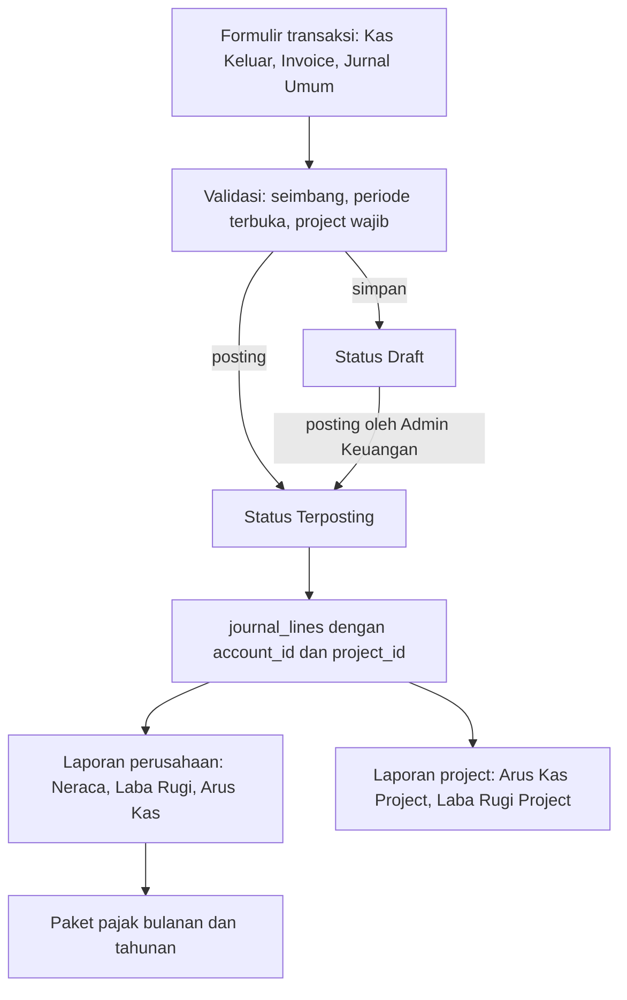
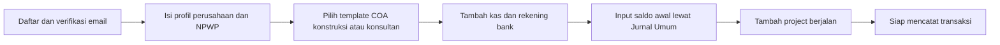

# PRD — Menara Kas

Aplikasi akuntansi berbasis nomor akun untuk perusahaan project based.

| | |
|---|---|
| Versi dokumen | 1.1 |
| Status | Disetujui untuk implementasi MVP |
| Brand | Menara (PT Menara Mitra Solusi) |
| Produk | Menara Kas — akuntansi & keuangan project based |
| Produk saudara | Menara Angkut, Menara Tim, Menara Polis |
| Tech stack | Monolith Next.js (App Router) + PostgreSQL |
| Bahasa produk | Indonesia |

---

## 1. Ringkasan

Menara Kas adalah aplikasi akuntansi double-entry berbasis web untuk perusahaan yang bekerja per project: kontraktor, konsultan, EPC, agensi, event organizer, dan system integrator.

Aplikasi pembukuan yang sudah ada di pasar (Akuntansiku, Jurnal, Accurate Online kelas UMKM) memberi laporan keuangan tingkat perusahaan yang rapi, tetapi tidak menjawab pertanyaan harian pemilik perusahaan project based:

> "Project Renovasi Gedung B ini sebenarnya untung atau rugi, dan uangnya sekarang di mana?"

Nilai inti Menara Kas: **satu pembukuan, dua sudut pandang.** Setiap transaksi dicatat sekali dengan nomor akun yang benar sehingga laporan keuangan perusahaan tetap sah untuk pajak, dan pada saat yang sama setiap baris transaksi bisa ditandai ke satu atau beberapa project sehingga arus kas dan margin per project keluar tanpa rekap manual di spreadsheet.

---

## 2. Masalah yang dipecahkan

Kondisi yang ditemui pada calon pengguna:

1. **Pembukuan dan laporan project terpisah.** Finance mencatat di software akuntansi untuk kebutuhan pajak, lalu project manager membuat spreadsheet sendiri untuk memantau biaya project. Angka keduanya tidak pernah sama.
2. **Tidak tahu posisi kas per project.** Uang masuk dari Project A sering dipakai membiayai Project B. Tanpa arus kas per project, perusahaan merasa untung padahal kasnya defisit.
3. **Menjelang lapor pajak selalu panik.** Data harus dirapikan mendadak setiap bulan untuk PPN dan setiap tahun untuk SPT Badan. Konsultan pajak meminta paket dokumen yang sama berulang kali.
4. **Nomor akun tidak dipakai secara disiplin.** Pencatatan berbasis kategori bebas membuat laporan laba rugi tidak bisa direkonsiliasi dengan neraca.

Konsekuensinya: keputusan bisnis diambil dari perasaan, bukan dari angka, dan biaya jasa konsultan pajak lebih mahal karena data mentah tidak siap.

---

## 3. Persona

### 3.1 Bu Ratna — Direktur / Pemilik (persona utama)

Perusahaan kontraktor interior, 18 orang, 6–10 project berjalan bersamaan, omzet sekitar Rp 12 miliar per tahun.

- Tidak punya latar belakang akuntansi. Paham "untung", "kas", "belum dibayar".
- Membuka aplikasi 2–3 kali seminggu dari ponsel, biasanya di lokasi project.
- Pertanyaannya selalu sama: kas saya berapa, project mana yang boncos, siapa yang belum bayar.

Kebutuhan: dashboard yang langsung menjawab tiga pertanyaan itu tanpa harus paham debit-kredit.

### 3.2 Mas Dwi — Staf Finance / Admin (pengguna terbanyak)

Mencatat seluruh transaksi, menyiapkan invoice, mengejar pembayaran, menyiapkan data untuk konsultan pajak.

- Paham dasar akuntansi, pernah pakai Excel dan satu software akuntansi.
- Membuka aplikasi setiap hari kerja, berjam-jam, dari laptop.
- Menghargai kecepatan input keyboard, duplikasi transaksi, dan impor Excel.

Kebutuhan: input transaksi cepat dan tidak mudah salah, serta ekspor yang tinggal dikirim.

### 3.3 Pak Hendra — Project Manager (pengguna terbatas)

Bertanggung jawab atas biaya satu atau beberapa project.

- Tidak boleh melihat gaji dan keuangan perusahaan secara keseluruhan.
- Hanya butuh biaya dan penerimaan project yang dia pegang.

Kebutuhan: akses terbatas per project.

### 3.4 Ibu Sari — Konsultan Pajak Eksternal (pembaca laporan)

Tidak login ke aplikasi pada MVP. Menerima berkas.

Kebutuhan: satu berkas paket bulanan dan tahunan yang formatnya konsisten, lengkap, dan bisa dibuka di Excel.

---

## 4. Ruang lingkup

### 4.1 Masuk MVP

| Kode | Modul |
|---|---|
| M1 | Akun, perusahaan, dan hak akses |
| M2 | Master data: Chart of Account, kontak, project, kas & bank, aset tetap, kode pajak |
| M3 | Transaksi double-entry beserta dokumen sumbernya |
| M4 | Penandaan project pada baris transaksi |
| M5 | Laporan keuangan standar |
| M6 | Laporan project |
| M7 | Paket laporan pajak bulanan dan tahunan |
| M8 | Periode, tutup buku, dan jejak audit |
| M9 | Impor Excel dan ekspor PDF/Excel |
| M10 | Dashboard |
| M11 | Pipeline project sederhana: Quotation → Serah Terima → Invoicing |
| M12 | Dokumen cetak PDF: Quotation (A4), Invoice (A4), Berita Acara (A4), Kwitansi (A5) |
| M13 | Termin / progress billing berjenjang, retensi, dan jaminan pelaksanaan |

### 4.2 Tidak masuk MVP

Dicatat agar tidak masuk diam-diam ke dalam implementasi:

- Pengakuan pendapatan persentase penyelesaian (PSAK 72), WIP, dan cost-to-complete.
- Anggaran (RAB) per project dan laporan budget vs actual.
- Multi mata uang dan konsolidasi antar perusahaan.
- Payroll, absensi, dan inventory / stok gudang.
- Aplikasi mobile native. MVP responsif di browser ponsel.
- Integrasi Coretax, e-Faktur, e-Bupot, dan pembuatan file SPT.
- Rekonsiliasi bank otomatis lewat open banking.
- Pencatatan otomatis dari foto struk atau asisten AI.
- Kewajiban membuat Quotation sebelum Invoice. Quotation, Berita Acara, dan Kwitansi bersifat opsional.

Alasan: MVP harus membuktikan pembukuan berbasis nomor akun yang sekaligus menghasilkan laporan per project, lengkap dengan dokumen operasional project yang biasa dipakai kontraktor dan konsultan.

---

## 5. Modul dan kebutuhan detail

Penomoran kebutuhan: `Mx-y`. Setiap kebutuhan punya kriteria penerimaan yang bisa diuji.

### M1 — Akun, perusahaan, dan hak akses

**M1-1 Registrasi dan login.** Pengguna mendaftar dengan email dan kata sandi, lalu memverifikasi email.

Kriteria penerimaan:
- Kata sandi minimal 10 karakter, disimpan dengan hash bcrypt (`bcryptjs`).
- Sesi kedaluwarsa setelah 30 hari tidak aktif.
- Gagal login 5 kali dalam 15 menit memicu jeda 15 menit untuk email tersebut.
- Tautan verifikasi email berlaku 24 jam dan sekali pakai.

**M1-2 Satu pengguna, banyak perusahaan.** Pengguna bisa tergabung di beberapa perusahaan dan berpindah lewat pemilih perusahaan di header.

Kriteria penerimaan:
- Perusahaan aktif tersimpan di sesi, bukan di URL yang bisa ditebak.
- Setiap permintaan data memverifikasi ulang keanggotaan pengguna pada perusahaan aktif. Mengganti ID perusahaan di payload tidak memberi akses.

**M1-3 Onboarding perusahaan.** Saat membuat perusahaan, pengguna mengisi nama, kode perusahaan, NPWP, alamat, tahun buku, logo, dan memilih template Chart of Account.

Kriteria penerimaan:
- Tersedia dua template COA siap pakai: **Jasa Konstruksi & Kontraktor** dan **Jasa Konsultan & Agensi**.
- Setelah onboarding selesai, perusahaan langsung punya COA lengkap, akun kas dan bank pertama, serta periode tahun buku berjalan yang terbuka.
- Pengguna bisa memilih "mulai dari COA kosong" dan mengimpor COA sendiri lewat Excel.
- Kode perusahaan (contoh `MMS`, `KRY`) wajib diisi, unik per organisasi, huruf kapital 2–6 karakter, dan bisa diubah di Pengaturan. Kode ini dipakai pada nomor Quotation, Invoice, Berita Acara, dan Kwitansi.
- Logo dan profil perusahaan (nama, alamat, NPWP, telepon, email, rekening bank default) bisa diubah di Pengaturan dan langsung dipakai pada semua PDF cetak.

**M1-4 Peran dan hak akses.** Empat peran baku.

| Peran | Lihat laporan perusahaan | Input transaksi | Posting & tutup buku | Master data | Kelola pengguna |
|---|---|---|---|---|---|
| Owner | Semua | Ya | Ya | Ya | Ya |
| Admin Keuangan | Semua | Ya | Ya | Ya | Tidak |
| Staf Input | Tidak | Ya (draft) | Tidak | Tidak | Tidak |
| Manajer Project | Hanya project yang ditugaskan | Ya (draft, project sendiri) | Tidak | Tidak | Tidak |

Kriteria penerimaan:
- Staf Input hanya bisa menyimpan transaksi berstatus draft. Tombol posting tidak muncul dan permintaan posting dari API ditolak dengan 403.
- Manajer Project yang membuka laporan perusahaan mendapat 403, bukan halaman kosong.
- Manajer Project hanya melihat daftar project yang ditugaskan kepadanya, termasuk di dropdown pemilih project.

**M1-5 Undang pengguna.** Owner mengundang lewat email, menentukan peran, dan untuk Manajer Project menentukan project yang boleh diakses.

Kriteria penerimaan:
- Undangan kedaluwarsa 7 hari.
- Menghapus pengguna dari perusahaan tidak menghapus transaksi yang pernah dia buat. Nama pembuat tetap tercatat di jejak audit.

---

### M2 — Master data

**M2-1 Chart of Account.** Daftar akun bernomor dan berjenjang maksimal 3 tingkat.

Struktur nomor yang dipakai template bawaan:

| Awalan | Golongan | Contoh |
|---|---|---|
| 1 | Aset | 1-1100 Kas, 1-1200 Bank, 1-1300 Piutang Usaha |
| 2 | Liabilitas | 2-1100 Utang Usaha, 2-1300 Utang Pajak |
| 3 | Ekuitas | 3-1100 Modal Disetor, 3-3000 Laba Ditahan |
| 4 | Pendapatan | 4-1100 Pendapatan Jasa Konstruksi |
| 5 | Beban Pokok Project | 5-1100 Biaya Material, 5-1200 Biaya Upah Tukang, 5-1300 Biaya Subkontraktor |
| 6 | Beban Operasional | 6-1100 Gaji Kantor, 6-2100 Sewa Kantor |
| 7 | Pendapatan & Beban Lain | 7-1100 Pendapatan Bunga, 7-2100 Beban Administrasi Bank |

Kriteria penerimaan:
- Nomor akun unik per perusahaan.
- Golongan akun (Aset, Liabilitas, Ekuitas, Pendapatan, Beban Pokok Project, Beban Operasional, Lain-lain) ditentukan saat akun dibuat dan tidak bisa diubah setelah akun punya transaksi terposting.
- Akun yang pernah punya transaksi tidak bisa dihapus, hanya dinonaktifkan. Akun nonaktif tidak muncul di pemilih akun tetapi tetap muncul di laporan periode lama.
- Setiap akun punya penanda `klasifikasi arus kas` (Operasi, Investasi, Pendanaan) yang dipakai laporan arus kas.
- Akun kas dan bank ditandai khusus sebagai akun kas. Penanda ini yang membuat laporan arus kas bisa dihitung.
- Akun induk tidak bisa dipilih di transaksi. Hanya akun tingkat terakhir yang bisa dijurnal.

**M2-2 Kontak.** Satu tabel kontak dengan penanda peran ganda: pelanggan, vendor, karyawan.

Kriteria penerimaan:
- Satu kontak bisa sekaligus pelanggan dan vendor.
- Field NPWP, alamat, dan telepon tersedia karena dipakai di invoice dan rekap pajak.
- Kontak yang punya transaksi tidak bisa dihapus.

**M2-3 Project.** Master project.

Field: kode project, nama, pelanggan, nilai kontrak, tanggal mulai, target selesai, PIC, status pipeline (Quotation, Berjalan, Serah Terima, Selesai, Dibatalkan), catatan.

Kriteria penerimaan:
- Kode project unik per perusahaan dan tidak bisa diubah setelah ada transaksi atau dokumen (QT/INV/BA/KW) yang memakai project tersebut.
- Project berstatus Selesai atau Dibatalkan tidak muncul di pemilih project pada transaksi baru, tetapi masih bisa dipilih lewat pencarian eksplisit agar koreksi tetap mungkin.
- Nilai kontrak hanya dipakai sebagai pembanding di laporan, tidak membuat jurnal apa pun.
- Pipeline project bersifat sederhana dan visual di halaman detail project: Quotation → Berjalan / Serah Terima → Invoicing. Status bisa dipindah manual; tidak ada otomatisasi wajib antar tahap.
- Satu project boleh punya beberapa Quotation, beberapa Invoice, beberapa Berita Acara, dan beberapa Kwitansi.
- Project tidak wajib punya Quotation sebelum Invoice. Quotation, Berita Acara, dan Kwitansi opsional. Invoice tetap bisa dibuat langsung dari project.

**M2-4 Kas dan bank.** Daftar akun kas dan rekening bank, masing-masing terhubung ke satu akun COA.

Kriteria penerimaan:
- Satu rekening bank terhubung tepat ke satu akun COA bertanda akun kas.
- Saldo tampil real time dari buku besar, tidak disimpan sebagai kolom terpisah.

**M2-5 Aset tetap dan depresiasi garis lurus.**

Field: nama aset, tanggal perolehan, harga perolehan, nilai residu, masa manfaat (bulan), akun aset, akun akumulasi depresiasi, akun beban depresiasi, project (opsional).

Kriteria penerimaan:
- Aplikasi menghitung jadwal depresiasi bulanan garis lurus dan menampilkannya sebagai tabel.
- Depresiasi tidak otomatis terposting. Pengguna menekan aksi "Posting Depresiasi Bulan Ini" yang membuat satu jurnal berisi seluruh aset pada bulan tersebut.
- Posting depresiasi untuk bulan yang sama dua kali ditolak.
- Jika aset punya project, beban depresiasinya ikut tertandai ke project tersebut.

**M2-6 Kode pajak.** Daftar kode pajak yang dipakai untuk menandai transaksi.

Kode bawaan: PPN Keluaran, PPN Masukan, PPh 21, PPh 23, PPh 4(2), PPh 22, Non Pajak.

Kriteria penerimaan:
- Setiap kode pajak punya tarif default yang bisa diubah, dan terhubung ke satu akun utang atau piutang pajak.
- Tarif disimpan sebagai riwayat bertanggal sehingga transaksi lama tidak berubah saat tarif diperbarui.

---

### M3 — Transaksi

Semua transaksi pada akhirnya menjadi satu jurnal double-entry. Yang berbeda hanya formulirnya.

**M3-1 Formulir transaksi yang tersedia.**

| Formulir | Jurnal yang dibentuk |
|---|---|
| Kas Masuk | Debit akun kas/bank, kredit akun yang dipilih |
| Kas Keluar | Debit akun yang dipilih, kredit akun kas/bank |
| Transfer Kas & Bank | Debit kas/bank tujuan, kredit kas/bank sumber |
| Invoice Penjualan | Debit Piutang Usaha, kredit Pendapatan, kredit Utang PPN Keluaran |
| Terima Pembayaran | Debit kas/bank, debit PPh dipotong jika ada, kredit Piutang Usaha |
| Tagihan Pembelian | Debit Beban/Aset, debit Piutang PPN Masukan, kredit Utang Usaha |
| Bayar Tagihan | Debit Utang Usaha, kredit kas/bank, kredit Utang PPh jika memotong |
| Jurnal Umum | Baris bebas, minimal dua baris |
| Jurnal Penyesuaian | Sama seperti Jurnal Umum, ditandai sebagai penyesuaian |

Kriteria penerimaan:
- Total debit harus sama dengan total kredit. Simpan ditolak jika tidak seimbang, dengan pesan yang menyebutkan selisihnya.
- Satu baris jurnal hanya boleh berisi nilai debit atau nilai kredit, tidak keduanya.
- Jurnal minimal punya dua baris dan minimal satu baris bernilai bukan nol.
- Nomor transaksi dibuat otomatis per jenis dan per tahun, format `KM-2026-0001`, tanpa lompatan nomor.

**M3-2 Draft dan posting.** Transaksi punya status Draft, Terposting, atau Dibatalkan.

Kriteria penerimaan:
- Draft tidak masuk ke laporan mana pun, kecuali daftar transaksi yang menampilkannya dengan label draft.
- Transaksi terposting tidak bisa diedit atau dihapus. Koreksi dilakukan dengan aksi "Batalkan dengan Jurnal Balik" yang membuat jurnal pembalik bertanggal yang dipilih pengguna, lalu menautkan kedua jurnal.
- Pengguna bisa langsung memposting dari formulir jika perannya mengizinkan, tanpa harus menyimpan draft dulu.

**M3-3 Lampiran.** Setiap transaksi bisa menerima lampiran berkas.

Kriteria penerimaan:
- Format yang diterima: PDF, JPG, PNG, maksimal 10 MB per berkas, maksimal 10 berkas per transaksi.
- Berkas disimpan di object storage, bukan di database.
- Tautan unduh bersifat sementara dan hanya valid untuk anggota perusahaan tersebut.

**M3-4 Invoice penjualan yang bisa dicetak.**

Kriteria penerimaan:
- Invoice punya nomor otomatis (lihat M12-2), tanggal, jatuh tempo, pelanggan, project (opsional tapi disarankan), daftar item (deskripsi, kuantitas, harga satuan), diskon, PPN, dan total.
- Cetak PDF memakai logo dan kop perusahaan, serta rekening bank tujuan pembayaran. Ukuran A4.
- Status invoice dihitung dari pembayaran yang tercatat: Belum Dibayar, Dibayar Sebagian, Lunas, Jatuh Tempo.
- Satu invoice bisa dibayar beberapa kali, dan satu pembayaran bisa melunasi beberapa invoice.
- Invoice boleh dibuat tanpa Quotation terlebih dahulu. Jika dibuat dari Quotation, item dan nilai bisa disalin, lalu diubah.

**M3-5 Penandaan pajak pada transaksi.**

Kriteria penerimaan:
- Pada invoice penjualan dan tagihan pembelian, pengguna memilih apakah nilai termasuk PPN, belum termasuk PPN, atau non PPN.
- Nilai PPN dihitung aplikasi dan menjadi baris jurnal tersendiri ke akun pajak terkait.
- Pada pembayaran, pengguna bisa mencatat pemotongan PPh dengan memilih kode pajak dan nilainya. Pemotongan menjadi baris jurnal, bukan catatan teks.
- Nomor faktur pajak bisa diisi manual sebagai field teks, dan wajib terisi jika transaksi ber-PPN dan pengguna menandainya sudah difakturkan.

---

### M4 — Penandaan project

Inilah pembeda produk. Aturannya harus tegas agar laporan project konsisten.

**M4-1 Project ada di level baris, bukan di level transaksi.**

Kriteria penerimaan:
- Setiap baris jurnal punya kolom project yang boleh kosong.
- Satu transaksi bisa memuat baris untuk beberapa project sekaligus. Contoh: satu pembayaran material Rp 50.000.000 dipecah Rp 30.000.000 ke Project A dan Rp 20.000.000 ke Project B.
- Pada formulir Kas Keluar dan Kas Masuk, tersedia aksi "Pecah ke Beberapa Project" yang mengubah satu baris menjadi beberapa baris dengan akun yang sama.

**M4-2 Aturan wajib project.** Perusahaan bisa menetapkan bahwa golongan akun tertentu wajib punya project.

Kriteria penerimaan:
- Pengaturan default: seluruh akun Pendapatan (4) dan Beban Pokok Project (5) wajib punya project.
- Akun kas, bank, piutang, utang, ekuitas, dan Beban Operasional (6) tidak boleh diwajibkan, karena sifatnya milik perusahaan.
- Jika aturan dilanggar, posting ditolak dengan pesan yang menyebut nomor akun dan baris yang kosong.
- Mengubah aturan tidak mengubah transaksi lama.

**M4-3 Biaya bersama.** Beban operasional yang tidak bisa ditelusuri ke satu project tetap tanpa project.

Kriteria penerimaan:
- Laporan Laba Rugi per project menampilkan margin project sebelum beban operasional bersama, dan menyebut eksplisit bahwa beban bersama tidak dialokasikan.
- Ringkasan Portofolio Project menampilkan baris "Tidak Ditandai Project" agar total seluruh project selalu bisa direkonsiliasi dengan laba rugi perusahaan.

Ini keputusan desain yang disengaja: MVP tidak melakukan alokasi overhead otomatis, karena metode alokasi yang salah menghasilkan angka yang terlihat rapi tetapi menyesatkan.

---

### M5 — Laporan keuangan standar

Semua laporan punya penyaring periode (tanggal awal dan akhir, atau pilihan cepat bulan dan tahun), penyaring project opsional, tombol ekspor Excel dan PDF, serta kemampuan menelusuri angka sampai ke transaksi asal.

| Laporan | Isi | Catatan |
|---|---|---|
| Laporan Transaksi | Daftar seluruh transaksi dengan penyaring jenis, akun, project, kontak, status | Titik masuk paling sering dipakai finance |
| Jurnal | Transaksi terposting berurutan tanggal, dengan baris debit dan kredit | |
| Buku Besar | Mutasi per akun dengan saldo awal, mutasi, saldo akhir | Bisa disaring per project |
| Neraca Saldo | Saldo debit dan kredit seluruh akun pada akhir periode | Total debit wajib sama dengan total kredit |
| Laba Rugi | Pendapatan, Beban Pokok Project, Laba Kotor, Beban Operasional, Laba Usaha, Pendapatan & Beban Lain, Laba Bersih | Mode perbandingan dua periode |
| Neraca | Aset, Liabilitas, Ekuitas pada satu tanggal | Aset wajib sama dengan Liabilitas + Ekuitas |
| Perubahan Modal | Modal awal, setoran, prive, laba bersih periode, modal akhir | |
| Arus Kas | Metode tidak langsung, dikelompokkan Operasi, Investasi, Pendanaan | Saldo akhir wajib sama dengan total saldo akun kas di Neraca |
| Hutang & Piutang | Daftar terbuka per kontak dengan umur piutang 0–30, 31–60, 61–90, di atas 90 hari | |
| Daftar Aset & Depresiasi | Harga perolehan, akumulasi, nilai buku | |

Kriteria penerimaan lintas laporan:
- Setiap laporan menampilkan tanggal cetak, nama perusahaan, dan rentang periode di kepala dokumen, termasuk pada ekspor.
- Angka nol ditampilkan sebagai `-`, angka negatif dalam tanda kurung, contoh `(1.250.000)`.
- Klik pada angka mutasi membuka daftar transaksi penyusunnya.
- Laporan yang mengandung periode terkunci menampilkan penanda bahwa data sudah final.

---

### M6 — Laporan project

**M6-1 Arus Kas per Project.** Menjawab "uang project ini masuk berapa, keluar berapa, sisanya berapa".

Kriteria penerimaan:
- Menampilkan penerimaan kas dan pengeluaran kas yang tertandai project tersebut, dikelompokkan per akun, dengan subtotal per bulan.
- Baris terakhir adalah Arus Kas Bersih Project.
- Laporan menyebut eksplisit bahwa ini arus kas, bukan laba, dan bahwa invoice yang belum dibayar tidak masuk hitungan.
- Transaksi non kas, misalnya invoice yang belum dibayar atau depresiasi, tidak boleh muncul di laporan ini.

**M6-2 Laba Rugi per Project.**

Kriteria penerimaan:
- Struktur: Pendapatan Project, Beban Pokok Project per akun, Laba Kotor Project, Marjin Kotor dalam persen.
- Ada catatan tetap di bawah laporan: beban operasional perusahaan tidak dialokasikan ke project.
- Mode perbandingan: satu project antar bulan, atau beberapa project dalam satu periode.

**M6-3 Ringkasan Portofolio Project.** Satu tabel berisi semua project.

Kolom: Kode, Nama Project, Status, Nilai Kontrak, Sudah Difakturkan, Sudah Diterima, Belum Diterima, Biaya Project, Laba Kotor, Marjin, Arus Kas Bersih.

Kriteria penerimaan:
- Ada baris "Tidak Ditandai Project" dan baris Total.
- Total kolom Pendapatan dan Biaya pada tabel ini wajib sama dengan angka Laba Rugi perusahaan pada periode yang sama. Ini dijadikan tes otomatis.
- Bisa diurutkan menurut marjin untuk menemukan project paling merugi.

**M6-4 Halaman detail project.** Satu halaman per project yang menggabungkan ringkasan angka, daftar transaksi project, daftar invoice beserta status pembayaran, dan grafik arus kas kumulatif.

Kriteria penerimaan:
- Halaman bisa dibuka Manajer Project yang ditugaskan.
- Grafik arus kas kumulatif menampilkan garis nol agar periode defisit kas terlihat jelas.

---

### M7 — Paket laporan pajak

Tujuan modul ini bukan menghitung pajak terutang, melainkan menyiapkan berkas yang siap diserahkan ke konsultan pajak. Dinyatakan eksplisit di UI agar tidak menimbulkan ekspektasi salah.

**M7-1 Rekap PPN.**

Kriteria penerimaan:
- Rekap PPN Keluaran per bulan: tanggal, nomor invoice, nomor faktur pajak, nama pelanggan, NPWP, dasar pengenaan pajak, nilai PPN.
- Rekap PPN Masukan per bulan dengan struktur setara dari sisi vendor.
- Baris total per bulan, dan selisih PPN Keluaran dikurangi PPN Masukan ditampilkan sebagai informasi, disertai catatan bahwa angka ini belum memperhitungkan kompensasi lebih bayar periode sebelumnya.
- Transaksi ber-PPN yang belum punya nomor faktur pajak ditandai agar mudah dilengkapi.

**M7-2 Rekap PPh dipotong.**

Kriteria penerimaan:
- Dikelompokkan per pasal (21, 22, 23, 4 ayat 2).
- Kolom: tanggal, kontak, NPWP, dasar pemotongan, tarif, nilai potongan, nomor bukti potong (field teks manual).
- Total per pasal per bulan.

**M7-3 Paket Laporan Bulanan.** Satu aksi menghasilkan satu berkas ZIP.

Isi: Neraca, Laba Rugi, Arus Kas, Neraca Saldo, Buku Besar, Jurnal, Rekap PPN Keluaran, Rekap PPN Masukan, Rekap PPh, Daftar Hutang & Piutang. Masing-masing dalam PDF dan satu file Excel multi sheet.

Kriteria penerimaan:
- Nama berkas mengikuti pola `LaporanBulanan_{NamaPerusahaan}_{YYYY-MM}.zip` tanpa spasi.
- Proses berjalan di latar belakang dan pengguna mendapat notifikasi ketika berkas siap diunduh.
- Paket menyertakan satu halaman ringkasan berisi daftar isi, periode, status tutup buku, dan jumlah transaksi yang masih draft pada periode tersebut.

**M7-4 Paket Laporan Tahunan.**

Isi: Neraca komparatif dua tahun, Laba Rugi tahunan dengan rincian 12 bulan, Perubahan Modal, Arus Kas tahunan, Neraca Saldo akhir tahun, Daftar Aset dan Depresiasi, rekap PPN dan PPh 12 bulan, Ringkasan Portofolio Project.

Kriteria penerimaan:
- Aplikasi menolak membuat paket tahunan jika masih ada transaksi draft di tahun tersebut, dan menampilkan daftarnya.
- Paket menyertakan lembar rekonsiliasi sederhana antara laba bersih akuntansi dan catatan penyesuaian yang diisi manual pengguna, sebagai bahan konsultan pajak.

---

### M8 — Periode, tutup buku, jejak audit

**M8-1 Periode.** Tahun buku terdiri dari 12 periode bulanan dengan status Terbuka, Terkunci, atau Ditutup.

Kriteria penerimaan:
- Transaksi hanya bisa disimpan atau diposting pada periode Terbuka.
- Mengunci periode menolak transaksi baru tetapi masih bisa dibuka kembali oleh Owner, dengan alasan yang dicatat di jejak audit.
- Periode tidak bisa dikunci jika masih ada transaksi draft di dalamnya.

**M8-2 Tutup buku tahunan.**

Kriteria penerimaan:
- Aksi tutup buku membuat jurnal penutup yang memindahkan seluruh saldo akun Pendapatan dan Beban ke akun Laba Ditahan.
- Setelah tutup buku, seluruh periode tahun tersebut berstatus Ditutup dan tidak bisa dibuka kembali.
- Saldo awal tahun berikutnya dihitung dari saldo akhir akun neraca, bukan diinput ulang.
- Sebelum menjalankan, aplikasi menampilkan pratinjau jurnal penutup dan meminta konfirmasi dengan mengetik nama tahun buku.

**M8-3 Jejak audit.**

Kriteria penerimaan:
- Setiap pembuatan, perubahan, posting, pembalikan, penguncian periode, perubahan hak akses, dan perubahan master data tercatat dengan pengguna, waktu, dan nilai sebelum serta sesudah.
- Jejak audit tidak bisa diedit atau dihapus oleh siapa pun lewat aplikasi.
- Owner bisa melihat dan menyaring jejak audit per pengguna dan per rentang tanggal.

---

### M9 — Impor dan ekspor

**M9-1 Impor transaksi via Excel.**

Kriteria penerimaan:
- Pengguna mengunduh template Excel yang kolomnya sudah sesuai, termasuk kolom nomor akun dan kode project.
- Impor berjalan dua tahap: pratinjau dengan daftar kesalahan per baris, lalu konfirmasi.
- Impor bersifat semua atau tidak sama sekali. Jika ada satu baris gagal, tidak ada yang tersimpan.
- Pesan kesalahan menyebut nomor baris Excel dan penyebabnya, contoh "Baris 12: nomor akun 5-1100 wajib punya kode project".
- Transaksi hasil impor masuk sebagai draft dan ditandai sebagai hasil impor beserta nama berkas asalnya.

**M9-2 Impor COA, kontak, dan project.** Pola yang sama dengan M9-1.

**M9-3 Ekspor.**

Kriteria penerimaan:
- Semua laporan bisa diekspor ke Excel (nilai angka sebagai angka, bukan teks) dan PDF.
- Ekspor Excel mempertahankan struktur baris induk dan anak sebagai kolom terpisah agar bisa di-pivot.
- PDF memakai kop perusahaan, ukuran A4, dan memuat nomor halaman.

---

### M10 — Dashboard

Halaman pertama setelah login, dirancang untuk Bu Ratna.

Kriteria penerimaan:
- Empat kartu KPI di atas: Saldo Kas & Bank, Piutang Belum Tertagih, Utang Belum Dibayar, Laba Bersih Bulan Ini.
- Grafik arus kas masuk dan keluar 6 bulan terakhir.
- Tabel "Project Perlu Perhatian": project berjalan dengan marjin kotor di bawah 10 persen atau arus kas bersih negatif, maksimal 5 baris.
- Daftar "Perlu Ditindak": invoice jatuh tempo, transaksi draft, periode yang belum dikunci.
- Semua kartu bisa diklik menuju laporan sumbernya.
- Dashboard memuat dalam waktu di bawah 1,5 detik pada data 50.000 baris jurnal.

---

### M11 — Pipeline project sederhana

Pipeline visual di halaman detail project. Tujuannya memberi gambaran tahap project tanpa mewajibkan alur dokumen yang kaku.

**M11-1 Tahap pipeline.**

Tahap: Quotation → Berjalan → Serah Terima → Invoicing → Selesai.

Kriteria penerimaan:
- Status bisa dipindah manual oleh Owner, Admin Keuangan, atau Manajer Project yang ditugaskan.
- Memindah status tidak membuat atau menghapus dokumen apa pun secara otomatis.
- Halaman detail project menampilkan tahap aktif, daftar Quotation, Berita Acara, Invoice, dan Kwitansi terkait, serta ringkasan nilai kontrak vs sudah difakturkan vs sudah diterima.
- Filter daftar project bisa memakai tahap pipeline.

**M11-2 Opsionalitas dokumen.**

Kriteria penerimaan:
- Project boleh langsung membuat Invoice tanpa Quotation.
- Berita Acara dan Kwitansi boleh dibuat kapan saja selama project belum Dibatalkan.
- UI tidak memblokir aksi dengan pesan seperti "buat Quotation dulu". Yang ditampilkan hanya saran lembut jika belum ada Quotation.

---

### M12 — Dokumen cetak: Quotation, Invoice, Berita Acara, Kwitansi

**M12-1 Profil cetak perusahaan.**

Kriteria penerimaan:
- Di Pengaturan, pengguna mengatur: nama perusahaan, kode perusahaan, alamat, NPWP, telepon, email, logo, dan rekening bank default untuk dicantumkan di dokumen.
- Logo diterima PNG atau JPG, maksimal 2 MB, dan dipakai di semua PDF.
- Perubahan profil langsung berlaku untuk dokumen baru; dokumen yang sudah diterbitkan tidak diubah ulang kecuali pengguna mencetak ulang.

**M12-2 Penomoran dokumen.**

Nomor dibuat otomatis, berlanjut sepanjang satu tahun kalender, dan mengulang dari 001 setiap 1 Januari. Format:

| Dokumen | Format |
|---|---|
| Quotation | `xxx/QT-{kode perusahaan}/{bulan}/{tahun}` |
| Invoice | `xxx/INV-{kode perusahaan}/{bulan}/{tahun}` |
| Berita Acara | `xxx/BA-{kode perusahaan}/{bulan}/{tahun}` |
| Kwitansi | `xxx/KW-{kode perusahaan}/{bulan}/{tahun}` |

Contoh: `007/INV-MMS/09/2026` berarti invoice ke-7 tahun 2026 untuk perusahaan berkode MMS, dibuat di bulan September.

Kriteria penerimaan:
- `xxx` adalah nomor urut 3 digit (001, 002, …) yang berlanjut sepanjang tahun, terpisah per jenis dokumen (QT, INV, BA, KW punya urutan masing-masing).
- `{bulan}` dua digit (`01`–`12`), `{tahun}` empat digit.
- `{kode perusahaan}` diambil dari pengaturan, bukan diketik ulang per dokumen.
- Satu project boleh punya banyak QT, INV, BA, dan KW.
- Nomor yang sudah diterbitkan tidak bisa dipakai ulang, termasuk setelah dokumen dibatalkan.
- Saat tahun berganti, nomor urut kembali ke 001 untuk setiap jenis.

**M12-3 Quotation (A4).**

Field: nomor, tanggal, pelanggan, project, masa berlaku, daftar item, subtotal, diskon, PPN, total, catatan syarat.

Kriteria penerimaan:
- Status: Draft, Dikirim, Diterima, Ditolak, Kedaluwarsa.
- Bisa diubah menjadi Invoice dengan menyalin item; Quotation asal tetap ada dan tertaut.
- PDF A4 memakai kop, logo, dan nomor sesuai M12-2.
- Quotation **tidak** membuat jurnal.

**M12-4 Invoice (A4).** Sudah diatur di M3-4. PDF memakai format nomor M12-2.

**M12-5 Berita Acara (A4).**

Field: nomor, tanggal, project, pelanggan, uraian pekerjaan yang diserahkan, persentase atau nilai yang diakui, pihak penandatangan (pemberi kerja dan penerima), catatan.

Kriteria penerimaan:
- Status: Draft, Diterbitkan.
- Bisa ditautkan ke satu atau beberapa termin (M13) dan/atau ke Invoice.
- Berita Acara **tidak** membuat jurnal sendiri. Jurnal muncul saat Invoice terkait diposting.
- PDF A4 memakai kop, logo, dan nomor sesuai M12-2.

**M12-6 Kwitansi (A5).**

Field: nomor, tanggal, project (opsional), pelanggan/pembayar, uraian, nilai, metode pembayaran, tautan ke pembayaran atau invoice yang dilunasi.

Kriteria penerimaan:
- Ukuran cetak A5, orientasi portrait.
- Bisa dibuat dari pembayaran yang sudah tercatat, atau berdiri sendiri sebagai bukti penerimaan tanpa menaut invoice (dengan catatan bahwa bukti berdiri sendiri tidak menggantikan jurnal).
- Jika dibuat dari pembayaran terposting, nilai dan kontak disalin otomatis.
- PDF memakai kop ringkas, logo, dan nomor sesuai M12-2.

**M12-7 Pratinjau dan cetak.**

Kriteria penerimaan:
- Setiap dokumen punya aksi `🖨️ Cetak PDF` dan `👁️ Pratinjau`.
- Pratinjau menampilkan layout yang sama dengan PDF final.
- PDF dihasilkan di server dan bisa diunduh; isi angka wajib sama dengan data di layar.

---

### M13 — Termin, retensi, dan jaminan pelaksanaan

**M13-1 Termin / progress billing.**

Satu project punya daftar termin penagihan.

Field per termin: nomor urut, nama (contoh "Termin 1 — DP 30%"), persen dari nilai kontrak atau nilai tetap, tanggal rencana, status (Rencana, Siap Ditagih, Sudah Difakturkan, Lunas), tautan ke Invoice dan Berita Acara.

Kriteria penerimaan:
- Total persen seluruh termin boleh kurang dari 100 persen (sisa belum dijadwalkan), tetapi tidak boleh melebihi 100 persen.
- Membuat Invoice dari termin menyalin nilai termin; pengguna boleh menyesuaikan sebelum posting.
- Satu termin maksimal tertaut ke satu Invoice aktif. Invoice yang dibatalkan melepaskan tautan.
- Ringkasan di halaman project menampilkan: nilai kontrak, total rencana termin, sudah difakturkan, retensi tertahan, sudah diterima.

**M13-2 Retensi.**

Kriteria penerimaan:
- Pada Invoice, pengguna bisa menandai nilai retensi (persen atau nominal) yang ditahan pelanggan.
- Retensi membentuk baris jurnal ke akun Piutang Retensi (akun sistem), bukan mengurangi pendapatan.
- Saat retensi dibayar, pengguna mencatat Terima Pembayaran yang mengkredit Piutang Retensi dan mendebit kas/bank.
- Laporan portofolio project menampilkan kolom Retensi Tertahan.

**M13-3 Jaminan pelaksanaan.**

Field: jenis (Jaminan Pelaksanaan, Jaminan Uang Muka, Jaminan Pemeliharaan), nomor jaminan, bank/asuransi penerbit, nilai, tanggal terbit, tanggal jatuh tempo, project, status (Aktif, Dicairkan, Dikembalikan, Kedaluwarsa).

Kriteria penerimaan:
- Pencatatan jaminan adalah master data operasional. Jurnal hanya dibuat jika pengguna secara eksplisit mencatat biaya penerbitan jaminan atau pembekuan dana lewat Kas Keluar / Jurnal Umum.
- Dashboard "Perlu Ditindak" menampilkan jaminan yang jatuh tempo dalam 30 hari.
- Halaman project menampilkan daftar jaminan terkait.

---

## 6. Alur utama

### 6.1 Alur transaksi sampai laporan

### 6.2 Alur onboarding perusahaan baru

Kriteria penerimaan onboarding: pengguna baru bisa mencapai transaksi pertama yang terposting dalam waktu di bawah 15 menit tanpa bantuan.

### 6.3 Contoh alur satu project

Skenario yang dipakai sebagai fixture pengujian dan sebagai data demo:

1. Project `PRJ-001 Renovasi Kantor BCA Sudirman`, nilai kontrak Rp 500.000.000.
2. Invoice penjualan termin pertama, dasar pengenaan pajak Rp 200.000.000 plus PPN 11 persen Rp 22.000.000. Debit Piutang Usaha, kredit Pendapatan Jasa Konstruksi tertandai `PRJ-001`, kredit Utang PPN Keluaran.
3. Pelunasan invoice, dipotong PPh Pasal 4 ayat 2 sebesar 2 persen dari dasar pengenaan pajak, yaitu Rp 4.000.000. Kas diterima Rp 218.000.000. Debit Bank, debit Pajak Dibayar Dimuka PPh 4(2) tertandai `PRJ-001`, kredit Piutang Usaha.
4. Kas keluar pembelian material Rp 80.000.000. Debit Biaya Material tertandai `PRJ-001`, kredit Bank.
5. Kas keluar upah tukang Rp 45.000.000 tertandai `PRJ-001`.
6. Kas keluar sewa kantor Rp 15.000.000 tanpa project.

Hasil yang harus muncul:
- Laba Rugi Project `PRJ-001`: Pendapatan Rp 200.000.000, Biaya Rp 125.000.000, Laba Kotor Rp 75.000.000, Marjin 37,5 persen.
- Arus Kas Project `PRJ-001`: penerimaan Rp 200.000.000, pengeluaran Rp 129.000.000, arus kas bersih Rp 71.000.000.
- Selisih Rp 4.000.000 antara laba kotor dan arus kas bersih adalah PPh yang dipotong pelanggan. Halaman detail project wajib menampilkan kedua angka bersebelahan agar selisih ini terbaca, bukan meleburnya menjadi satu angka "keuntungan".
- Sewa kantor Rp 15.000.000 dan PPN titipan Rp 22.000.000 masuk baris "Tidak Ditandai Project", tidak ke laporan project mana pun.
- Total Ringkasan Portofolio, termasuk baris "Tidak Ditandai Project", sama dengan Laba Rugi dan mutasi kas perusahaan pada periode yang sama.

Perhitungan lengkap beserta susunan baris jurnalnya ada di [docs/data-model.md](data-model.md) bagian 6.4.

---

## 7. Kebutuhan non fungsional

**Performa.** Ukuran data acuan: 5 tahun data, 200.000 baris jurnal, 200 project, 20 pengguna aktif.
- Laporan Neraca dan Laba Rugi satu bulan selesai di bawah 800 ms pada persentil 95.
- Buku Besar satu akun satu tahun selesai di bawah 1,5 detik.
- Simpan transaksi selesai di bawah 400 ms.

**Ketepatan angka.** Uang tidak boleh disentuh tipe pecahan biner. Penyimpanan `numeric(18,2)`, perhitungan di aplikasi memakai bilangan bulat satuan terkecil. Pembulatan pajak selalu ke rupiah terdekat dan dilakukan satu kali, di titik pembentukan baris jurnal.

**Keamanan.** Isolasi data antar perusahaan diuji khusus. Setiap query wajib terikat identitas perusahaan. Kata sandi di-hash bcrypt. Berkas lampiran hanya bisa diakses lewat tautan bertanda tangan yang kedaluwarsa.

**Ketersediaan dan pemulihan.** Backup harian otomatis dengan retensi 30 hari, dan point in time recovery 7 hari. Prosedur restore diuji sebelum rilis produksi.

**Aksesibilitas.** Kontras teks minimal WCAG AA. Seluruh aksi utama bisa dijalankan dengan keyboard. Emoji selalu didampingi teks dan disembunyikan dari pembaca layar.

**Bahasa dan format.** Antarmuka Bahasa Indonesia. Format angka ribuan titik dan desimal koma. Tanggal `31 Des 2026`. Mata uang Rupiah tanpa desimal pada tampilan ringkas, dua desimal pada laporan detail.

**Perangkat.** Desktop adalah target utama untuk input dan laporan. Ponsel harus nyaman untuk dashboard, detail project, dan persetujuan.

---

## 8. Metrik sukses

| Metrik | Target 3 bulan setelah rilis |
|---|---|
| Waktu dari registrasi ke transaksi terposting pertama | Median di bawah 15 menit |
| Perusahaan yang mengisi minimal 30 transaksi di bulan pertama | 60 persen |
| Transaksi beban pokok yang tertandai project | Di atas 90 persen |
| Perusahaan yang mengunduh Paket Laporan Bulanan | 50 persen per bulan |
| Perusahaan yang menyelesaikan tutup buku bulanan tepat waktu | 40 persen |
| Retensi perusahaan berbayar bulan ketiga | 70 persen |

Metrik pembeda produk yang paling penting: persentase transaksi beban pokok yang tertandai project. Jika angka ini rendah, laporan project tidak dipercaya dan nilai inti produk gagal.

---

## 9. Roadmap

### Fase 1 — MVP (lihat [docs/phases.md](phases.md))

Seluruh modul M1 sampai M13 sesuai kriteria penerimaan di atas, dikerjakan per fase kecil dengan QA/QC di akhir setiap fase.

Urutan pengerjaan ringkas:
1. Fondasi: autentikasi, perusahaan (termasuk kode dan logo), hak akses, kerangka layout dan design system.
2. Master data COA, kontak, project (pipeline), kas dan bank.
3. Mesin jurnal, validasi, periode, jejak audit.
4. Formulir transaksi, Invoice, pembayaran, termin dan retensi.
5. Quotation, Berita Acara, Kwitansi, penomoran dokumen, cetak PDF.
6. Laporan standar, laporan project, dashboard.
7. Paket pajak, impor Excel, aset tetap, jaminan pelaksanaan, tutup buku.

### Fase produk lanjutan (setelah MVP)

- Anggaran atau RAB per project dan laporan rencana versus realisasi.
- Purchase order dan permintaan pembelian dengan persetujuan berjenjang.
- Pengeluaran kas kecil dari ponsel oleh Manajer Project, dengan persetujuan.
- Pengakuan pendapatan persentase penyelesaian dan WIP.
- Ekspor berformat impor Coretax, e-Faktur, dan e-Bupot.
- Rekonsiliasi bank dari mutasi CSV, lalu open banking.
- Konsolidasi antar perusahaan dan multi mata uang.
- Portal pelanggan untuk melihat invoice dan progres penagihan.

---

## 10. Risiko dan mitigasi

| Risiko | Dampak | Mitigasi |
|---|---|---|
| Pengguna tidak disiplin menandai project | Laporan project tidak berguna, nilai inti hilang | Aturan wajib project per golongan akun (M4-2), penanda di dashboard untuk transaksi tanpa project, laporan portofolio selalu menampilkan baris tidak tertandai |
| Pengguna mengharapkan aplikasi menghitung pajak terutang | Kekecewaan dan risiko hukum | Nyatakan jelas di UI dan materi pemasaran bahwa modul pajak adalah penyiapan berkas, bukan perhitungan pajak terutang |
| Migrasi dari Excel gagal di tengah jalan | Pengguna berhenti pakai | Impor Excel dua tahap dengan pratinjau kesalahan, template siap pakai, dan panduan saldo awal |
| Laporan lambat setelah data menumpuk | Pengguna kembali ke spreadsheet | Agregasi di SQL, indeks sesuai pola laporan, dan uji beban dengan 200.000 baris sejak awal |
| Angka laporan tidak bisa direkonsiliasi satu sama lain | Kepercayaan hilang, tidak bisa dipakai untuk pajak | Invariant akuntansi sebagai tes otomatis wajib lulus di CI, fixture angka yang diverifikasi manual |
| Kebocoran data antar perusahaan | Fatal | Seluruh akses data lewat satu lapisan yang wajib menerima identitas perusahaan, ditambah tes isolasi khusus |

---

## 11. Asumsi

- Satu perusahaan memakai satu mata uang, yaitu Rupiah.
- Metode akuntansi yang dipakai adalah akrual.
- Persediaan barang dagang tidak diperlukan. Material dibebankan langsung ke project saat dibeli.
- Perusahaan pengguna berstatus Pengusaha Kena Pajak atau sedang bersiap menjadi PKP.
- Konsultan pajak tetap menjadi pihak yang menyusun dan melaporkan SPT.

---

## 12. Dokumen terkait

- [docs/design-system.md](design-system.md) — palet warna, tipografi, kamus emoji, komponen UI.
- [docs/data-model.md](data-model.md) — ERD, skema tabel, invariant akuntansi, mekanisme laporan project.
- [docs/architecture.md](architecture.md) — struktur aplikasi, pilihan library, pola implementasi.
- [docs/phases.md](phases.md) — fase pengerjaan otomatis untuk agen AI, lengkap dengan QA/QC antar fase.
- [AGENTS.md](../AGENTS.md) — aturan anti-slop dan konvensi kode.
