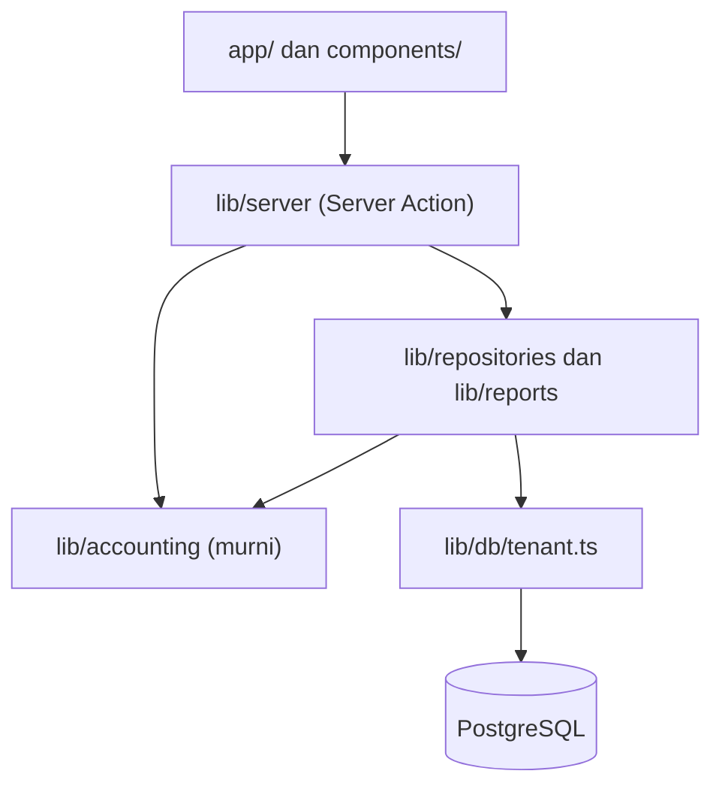
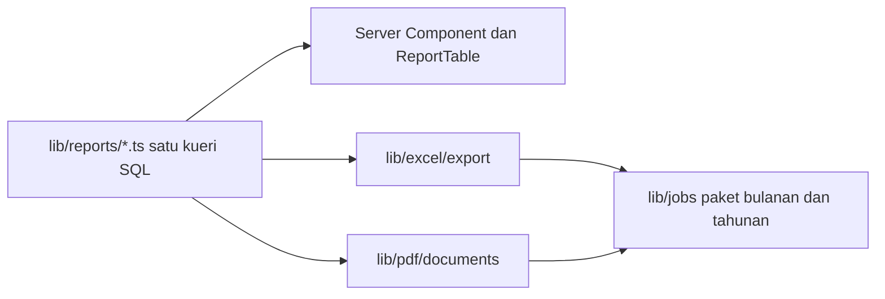

# Arsitektur — Menara Kas

Satu aplikasi Next.js, satu basis data PostgreSQL, satu proses penyebaran. Tidak ada microservice, tidak ada backend terpisah, tidak ada GraphQL.

---

## 1. Prinsip

1. **Monolith yang punya batas jelas di dalam.** Kesederhanaan penyebaran bukan alasan untuk mencampur logika akuntansi dengan komponen React.
2. **Logika akuntansi adalah kode murni.** Modul `lib/accounting` tidak boleh mengimpor apa pun dari `next`, `react`, atau lapisan basis data. Modul ini menerima angka dan mengembalikan angka, sehingga bisa diuji tanpa basis data dan tanpa browser.
3. **Satu jalan menuju basis data.** Seluruh akses melewati satu pembungkus yang wajib menerima konteks organisasi. Tidak ada kode fitur yang memegang klien basis data mentah.
4. **Satu tempat membentuk jurnal.** Setiap formulir transaksi menghasilkan masukan yang diserahkan ke satu mesin posting. Tidak ada fitur yang menulis `journal_lines` sendiri.
5. **Agregasi di SQL.** Basis data yang menjumlahkan, bukan JavaScript.
6. **Tolak lebih awal.** Validasi terjadi di batas server, bukan setelah separuh proses berjalan.

---

## 2. Susunan teknologi

Prinsip: mudah dipahami dan dirawat oleh satu developer yang paham JavaScript. Library hanya ditambah jika fungsi bawaan Node/Next/browser tidak cukup.

| Lapisan | Pilihan | Alasan |
|---|---|---|
| Kerangka | Next.js (App Router) + React | Satu proses untuk halaman dan mutasi (Server Action). Sudah umum di ekosistem JS |
| Bahasa | TypeScript, `strict` menyala | `any` dilarang, lihat [AGENTS.md](../AGENTS.md). Tetap JavaScript di dasar |
| Basis data | PostgreSQL 16 | `numeric` presisi tetap, RLS, trigger untuk invariant |
| Akses data | `pg` (node-postgres) + SQL mentah bertipe | Tanpa ORM berat. Query terlihat apa adanya, mudah di-debug. Skema dan migrasi lewat berkas SQL di `lib/db/migrations/` |
| Autentikasi | Auth.js (NextAuth) Credentials + sesi JWT/cookie | Paket resmi ekosistem Next, dokumentasi banyak, cukup untuk email+kata sandi |
| Hash sandi | `bcryptjs` | Sederhana, dikenal luas di komunitas JS |
| Validasi | Zod | Satu skema untuk formulir dan Server Action |
| Antarmuka | Tailwind CSS v4 | Utility CSS tanpa komponen library tambahan. Tidak memakai Radix, shadcn, atau pustaka ikon |
| Tabel | HTML `<table>` + CSS sticky | Cukup untuk laporan. Tidak memakai TanStack Table |
| Grafik | SVG sederhana buatan sendiri, atau satu chart ringan jika terpaksa | Dashboard hanya butuh garis/batang dasar |
| Excel | SheetJS (`xlsx`) | Impor/ekspor Excel yang paling dikenal di komunitas JS |
| PDF dokumen | HTML template + `@sparticuz/chromium-min` / Playwright print, atau CSS `@media print` untuk pratinjau | Layout Quotation/Invoice/BA/Kwitansi ditulis sebagai halaman HTML biasa, lalu dicetak ke PDF. Developer JS tidak perlu belajar DSL PDF terpisah |
| Tugas berat | Tabel `report_jobs` + cron sederhana (`node-cron`) di proses worker ringan | Tanpa Redis dan tanpa pg-boss. Satu worker Node yang memproses antrian |
| Penyimpanan berkas | Lokal `uploads/` di development; S3-kompatibel (R2) di produksi | Lampiran dan PDF hasil generate |
| Uji | Vitest + Playwright | Unit untuk akuntansi, e2e untuk alur kritis. PostgreSQL diuji dengan database lokal/docker, bukan mock |

Teknologi yang **sengaja tidak dipakai** agar tidak membebani maintenance:

- ORM berat (Prisma, Drizzle) — ganti SQL mentah yang transparan
- Radix / shadcn / pustaka komponen UI
- TanStack Table, Recharts, state management global (Redux/Zustand)
- tRPC, GraphQL, Redis, microservice
- `decimal.js` — pakai `bigint` satuan sen
- better-auth, pg-boss, ExcelJS, `@react-pdf/renderer`

Menambah paket baru wajib dijelaskan di pull request: apa yang dibutuhkan, dan mengapa yang sudah ada tidak cukup.

---

## 3. Struktur direktori

```
app/
  (auth)/
    masuk/page.tsx
    daftar/page.tsx
    lupa-sandi/page.tsx
  (app)/
    layout.tsx                  header, sidebar, pemilih perusahaan dan periode
    dashboard/page.tsx
    transaksi/
      page.tsx                  daftar transaksi
      baru/[jenis]/page.tsx     kas-masuk, kas-keluar, jurnal-umum, ...
      [id]/page.tsx
    invoice/
    project/
      page.tsx
      [kode]/page.tsx
    laporan/
      laba-rugi/page.tsx
      neraca/page.tsx
      arus-kas/page.tsx
      buku-besar/page.tsx
      project/arus-kas/page.tsx
      project/portofolio/page.tsx
      pajak/ppn/page.tsx
      paket/page.tsx
    master/
      akun/  kontak/  project/  kas-bank/  aset/  pajak/
    periode/page.tsx
    pengaturan/
      perusahaan/  pengguna/  audit/
  api/
    lampiran/[id]/route.ts      redirect ke URL bertanda tangan
    unduh/[jobId]/route.ts      unduh hasil paket laporan
    health/route.ts
  globals.css
  fonts.ts

lib/
  accounting/                   DOMAIN MURNI, tanpa I/O
    money.ts                    bigint rupiah sen, format, parse
    balance.ts                  keseimbangan, saldo normal, tanda akun
    posting/
      types.ts                  DraftEntry, DraftLine
      build-general.ts
      build-cash.ts
      build-invoice.ts
      build-bill.ts
      build-payment.ts
      build-depreciation.ts
      build-closing.ts
      build-reversal.ts
      validate.ts               invariant I1, I2, I5, I6
    allocate.ts                 pembagian sisa terbesar
    depreciation.ts
    tax.ts                      PPN dan PPh, pembulatan sekali
  db/
    client.ts                   pool pg, tidak diekspor ke luar lib/db
    tenant.ts                   withOrg, satu-satunya pintu kueri
    migrations/                 berkas SQL berurutan
    seed/
      coa-konstruksi.ts
      coa-konsultan.ts
      demo.ts
  documents/                    template HTML → PDF
    quotation.ts
    invoice.ts
    berita-acara.ts
    kwitansi.ts
    render-pdf.ts
  server/
    action.ts                   defineAction: auth, validasi, peran, audit
    auth.ts                     requireSession, requireRole
    errors.ts                   kesalahan domain dan pesan Indonesia
    audit.ts
  repositories/                 satu berkas per agregat, memakai withOrg
    entries.ts
    accounts.ts
    projects.ts
    invoices.ts
  reports/                      kueri baca, mengembalikan data biasa
    trial-balance.ts
    income-statement.ts
    balance-sheet.ts
    cash-flow.ts
    general-ledger.ts
    project-profit.ts
    project-cash-flow.ts
    project-portfolio.ts
    tax-ppn.ts
    tax-withholding.ts
    aging.ts
  excel/
    export/  import/  templates/
  pdf/
    documents/                  satu berkas per laporan
    theme.ts                    warna dan huruf dari design system
  jobs/
    queue.ts
    monthly-package.ts
    annual-package.ts
  ui/
    emoji.ts                    kamus emoji, satu-satunya sumber
    format.ts                   rupiah, tanggal, persen
    cn.ts

components/
  ui/                           tombol, medan isian, lencana, dialog, notifikasi
  form/                         MoneyInput, AccountPicker, ProjectPicker, JournalLines
  table/                        DataTable, ReportTable, StickyHeader
  report/                       ReportHeader, ReportFilters, ExportButtons
  layout/                       Sidebar, TopBar, OrgSwitcher, PeriodSwitcher

tests/
  unit/                         lib/accounting, tanpa basis data
  integration/                  PostgreSQL lokal/Docker, invariant dan laporan
  e2e/                          Playwright, alur pengguna
  fixtures/
    prj-001.ts                  skenario di data-model.md bagian 6.4

docs/
```

### 3.1 Arah ketergantungan



Aturan yang ditegakkan lint:
- `lib/accounting` tidak boleh mengimpor `next`, `react`, `lib/db`, atau `lib/repositories`.
- `app/` dan `components/` tidak boleh mengimpor `lib/db` atau `lib/repositories` secara langsung. Halaman memanggil fungsi di `lib/reports`, mutasi memanggil Server Action.
- Hanya `lib/db/tenant.ts` yang boleh mengimpor `lib/db/client.ts`.

Aturan ini ditulis sebagai konfigurasi `import/no-restricted-paths` sehingga pelanggaran gagal di CI, bukan sekadar disepakati.

---

## 4. Konteks organisasi dan isolasi data

Satu-satunya pintu menuju basis data:

```ts
// lib/db/tenant.ts
import { pool } from "./client";

export type OrgContext = { orgId: string; userId: string };

export async function withOrg<T>(
  ctx: OrgContext,
  fn: (client: PoolClient) => Promise<T>,
): Promise<T> {
  const client = await pool.connect();
  try {
    await client.query("BEGIN");
    await client.query("SELECT set_config('app.org_id', $1, true)", [ctx.orgId]);
    await client.query("SELECT set_config('app.user_id', $1, true)", [ctx.userId]);
    const result = await fn(client);
    await client.query("COMMIT");
    return result;
  } catch (error) {
    await client.query("ROLLBACK");
    throw error;
  } finally {
    client.release();
  }
}
```

Aturan yang menyertainya:
- Nilai `orgId` berasal dari sesi terverifikasi, bukan dari parameter permintaan atau isi formulir. Mengganti nilai di payload tidak mengubah apa pun.
- Setiap kueri di `lib/repositories` dan `lib/reports` tetap menulis `where org_id = ctx.orgId` secara eksplisit. Row Level Security adalah jaring pengaman, bukan pengganti kode yang benar.
- Peran basis data aplikasi bukan pemilik tabel, sehingga RLS tidak bisa dilewati.
- `SET LOCAL` berlaku hanya selama transaksi, jadi koneksi yang kembali ke pool tidak membawa sisa konteks.

---

## 5. Pola Server Action

Satu pembantu menangani urusan yang sama di setiap mutasi: sesi, konteks organisasi, validasi, pemeriksaan peran, pencatatan audit, dan pemetaan kesalahan.

```ts
// lib/server/action.ts
import { z } from "zod";
import { requireSession } from "./auth";
import { DomainError } from "./errors";
import type { MemberRole } from "@/lib/db/schema";

export type ActionResult<T> =
  | { ok: true; data: T }
  | { ok: false; message: string; fieldErrors?: Record<string, string> };

export function defineAction<I extends z.ZodTypeAny, O>(config: {
  input: I;
  roles: MemberRole[];
  audit: string;
  handler: (input: z.infer<I>, ctx: OrgContext) => Promise<O>;
}) {
  return async (raw: unknown): Promise<ActionResult<O>> => {
    const session = await requireSession();

    if (!config.roles.includes(session.role)) {
      return { ok: false, message: "Peran Anda tidak boleh melakukan aksi ini." };
    }

    const parsed = config.input.safeParse(raw);
    if (!parsed.success) {
      return {
        ok: false,
        message: "Ada isian yang belum benar.",
        fieldErrors: flattenZodErrors(parsed.error),
      };
    }

    try {
      const data = await config.handler(parsed.data, session.ctx);
      await recordAudit(session.ctx, config.audit, data);
      return { ok: true, data };
    } catch (error) {
      if (error instanceof DomainError) {
        return { ok: false, message: error.message, fieldErrors: error.fieldErrors };
      }
      throw error;
    }
  };
}
```

Pemakaian:

```ts
// app/(app)/transaksi/actions.ts
"use server";

export const postCashOut = defineAction({
  input: cashOutSchema,
  roles: ["OWNER", "ADMIN_KEUANGAN"],
  audit: "ENTRY_POSTED",
  handler: async (input, ctx) => {
    const draft = buildCashOutEntry(input, await loadPostingConfig(ctx));
    validateDraftEntry(draft);
    return postEntry(ctx, draft);
  },
});
```

Aturan:
- Server Action tidak pernah melempar kesalahan mentah ke antarmuka. Kesalahan domain menjadi pesan berbahasa Indonesia yang menyebut cara memperbaiki.
- Kesalahan yang tidak dikenali dilempar ulang agar tercatat di pemantauan. Menelan kesalahan dilarang.
- `roles` wajib ditulis di setiap aksi. Tidak ada nilai default yang permisif.
- Pembacaan data untuk halaman memakai Server Component yang memanggil `lib/reports`, bukan Server Action.

### 5.1 Otorisasi Manajer Project

Peran `MANAJER_PROJECT` punya batas tambahan yang tidak bisa diwakili daftar peran saja. Batas ini diterapkan di `lib/repositories` dan `lib/reports` melalui satu fungsi:

```ts
// lib/server/auth.ts
export function projectScope(session: Session): string[] | "SEMUA" {
  return session.role === "MANAJER_PROJECT" ? session.allowedProjectIds : "SEMUA";
}
```

Setiap kueri laporan menerima nilai ini dan menambahkan `AND project_id = ANY($n)` bila perlu. Laporan tingkat perusahaan menolak permintaan dari peran ini dengan 403, bukan mengembalikan halaman kosong, sesuai kebutuhan M1-4.

---

## 6. Uang

Uang tidak pernah menjadi `number` JavaScript.

```ts
// lib/accounting/money.ts
/** Rupiah dalam satuan sen. 1 rupiah = 100n. */
export type Money = bigint;

export function fromRupiah(value: string | number): Money { ... }
export function toDbNumeric(value: Money): string { ... }   // "218000000.00"
export function fromDbNumeric(value: string): Money { ... }
export function formatRupiah(value: Money, opts?: { decimals?: 0 | 2 }): string { ... }
```

Aturan:
- Perhitungan memakai `bigint` satuan sen. Tidak ada `parseFloat`, tidak ada `Number()` pada nilai uang, tidak ada `decimal.js`.
- Drizzle mengembalikan `numeric` sebagai `string`. String itu dikonversi lewat `fromDbNumeric`, tidak pernah lewat `Number()`.
- Pembulatan terjadi **satu kali**, di titik pembentukan baris jurnal di `lib/accounting/tax.ts`. Pembulatan berantai adalah sumber selisih satu rupiah yang paling sering.
- Pembagian nilai ke beberapa project memakai `allocateByWeights` dengan metode sisa terbesar, sehingga jumlah pecahan selalu tepat sama dengan nilai asal.
- Format tampilan hanya boleh dilakukan `lib/ui/format.ts`. Komponen tidak memanggil `toLocaleString` sendiri.

Tanggal transaksi memakai tipe `date` PostgreSQL dan diproses sebagai `YYYY-MM-DD` tanpa zona waktu, karena tanggal jurnal adalah fakta kalender, bukan titik waktu. Hanya kolom jejak waktu seperti `created_at` yang memakai `timestamptz`. Tampilan memakai zona `Asia/Jakarta`.

---

## 7. Mesin posting

Jantung aplikasi. Dua tahap yang dipisah tegas: membentuk dan menyimpan.

```ts
// lib/accounting/posting/types.ts
export type DraftLine = {
  accountId: string;
  projectId: string | null;
  contactId: string | null;
  taxCodeId: string | null;
  debit: Money;
  credit: Money;
  description: string | null;
};

export type DraftEntry = {
  entryDate: string;
  source: EntrySource;
  memo: string | null;
  lines: DraftLine[];
};
```

**Tahap satu, membentuk.** Satu fungsi `build*` per jenis transaksi. Semuanya murni: menerima masukan formulir dan konfigurasi posting (pemetaan `account_roles`, tarif pajak, aturan wajib project), mengembalikan `DraftEntry`. Tidak menyentuh basis data, tidak membaca waktu sekarang, tidak menghasilkan nomor transaksi.

Karena murni, seluruh perilaku akuntansi bisa diuji sebagai tabel masukan dan keluaran, termasuk kasus PPN termasuk harga, pemotongan PPh, pemecahan ke beberapa project, dan pembulatan.

**Tahap dua, memvalidasi dan menyimpan.**

```ts
// lib/repositories/entries.ts
export async function postEntry(ctx: OrgContext, draft: DraftEntry) {
  validateDraftEntry(draft);                 // I1, I2, I6

  return withOrg(ctx, async (tx) => {
    const period = await findOpenPeriod(tx, ctx.orgId, draft.entryDate);
    const accounts = await loadAccountsForLines(tx, ctx.orgId, draft.lines);
    assertAccountsPostable(accounts, draft.lines);            // I5
    assertRequiredProjects(accounts, draft.lines, orgRules);  // I6

    const entryNo = await nextNumber(tx, ctx.orgId, prefixFor(draft.source), year);
    const hasCashLine = draft.lines.some((l) => accounts.get(l.accountId)!.isCash);

    const [entry] = await tx.insert(journalEntries).values({ ... }).returning();
    await tx.insert(journalLines).values(draft.lines.map(toRow(entry.id)));
    return entry;
  });
}
```

Aturan:
- Seluruh penyimpanan berada dalam satu transaksi basis data, termasuk pengambilan nomor urut. Nomor tidak melompat dan tidak kembar.
- `has_cash_line` dihitung di sini dan tidak pernah diubah lagi, karena laporan arus kas project bergantung padanya. Lihat [docs/data-model.md](data-model.md) bagian 6.2.
- Validasi dilakukan dua kali dengan sengaja: di kode dan di trigger basis data. Trigger yang menjadi kata terakhir, sehingga jalur apa pun, termasuk impor Excel dan skrip perbaikan data, tidak bisa menghasilkan jurnal tidak seimbang.
- Koreksi transaksi terposting memakai `build-reversal.ts` yang membalik seluruh baris dan menautkan `reversal_of_id`. Tidak ada jalur `UPDATE` pada jurnal terposting.

---

## 8. Lapisan laporan

Setiap laporan adalah satu fungsi di `lib/reports` dengan bentuk yang sama:

```ts
export async function getIncomeStatement(
  ctx: OrgContext,
  params: {
    from: string;
    to: string;
    projectId?: string;
    compareTo?: { from: string; to: string };
    scope: string[] | "SEMUA";
  },
): Promise<IncomeStatement> { ... }
```

Aturan:
- Satu laporan sama dengan satu kueri, atau satu kueri CTE, dan mengembalikan data yang sudah siap ditampilkan.
- Penjumlahan, pengelompokan, saldo awal, dan perbandingan periode dilakukan SQL. Mengambil baris jurnal ke JavaScript untuk dijumlahkan dilarang.
- Fungsi laporan mengembalikan `Money` dalam bentuk `bigint`, bukan string terformat. Pemformatan adalah urusan antarmuka.
- Setiap laporan mengembalikan `meta` berisi nama perusahaan, nama laporan, dan rentang periode, karena bagian ini dipakai di layar, di PDF, dan di Excel tanpa disusun ulang tiga kali.
- Ekspor Excel dan PDF memanggil fungsi laporan yang sama dengan yang dipakai layar. Tidak ada kueri terpisah untuk ekspor. Ini yang menjamin angka di layar dan di berkas identik.



---

## 9. Tugas latar belakang

Hanya satu kebutuhan di MVP: paket laporan bulanan dan tahunan, yang menghasilkan belasan berkas dan terlalu lama untuk satu permintaan HTTP.

- Antrean memakai tabel `report_jobs` di PostgreSQL yang sama. Worker Node terpisah (`worker.ts`) memproses baris berstatus `MENUNGGU` lewat `node-cron` setiap beberapa detik.
- Tidak ada Redis dan tidak ada pg-boss.
- Keadaan tugas tercatat di `report_jobs`. Antarmuka menampilkan kemajuan dan menyediakan tautan unduh setelah selesai.
- Tugas bersifat idempoten: menjalankan ulang paket bulan yang sama menimpa berkas lama, tidak menggandakannya.
- Kegagalan tercatat di `report_jobs.error_message` dengan pesan yang bisa dibaca pengguna, dan tugas bisa dicoba ulang tanpa membuat data baru.

---

## 10. Kesalahan

Tiga golongan, ditangani berbeda:

| Golongan | Contoh | Penanganan |
|---|---|---|
| Validasi masukan | Tanggal kosong, nominal bukan angka | Zod, pesan per medan isian |
| Aturan domain | Jurnal tidak seimbang, periode terkunci, akun wajib project | `DomainError`, pesan yang menyebut cara memperbaiki |
| Kegagalan sistem | Basis data tidak terjangkau, penyimpanan berkas gagal | Dilempar ulang, tercatat di pemantauan, antarmuka menampilkan pesan umum dan tombol coba lagi |

```ts
// lib/server/errors.ts
export class DomainError extends Error {
  constructor(
    message: string,
    readonly fieldErrors?: Record<string, string>,
  ) {
    super(message);
    this.name = "DomainError";
  }
}
```

Pesan kesalahan domain wajib menyebut angka atau objek yang bermasalah. `"Jurnal belum seimbang. Selisih 250.000 di sisi kredit."` bisa ditindaklanjuti; `"Validasi gagal"` tidak.

---

## 11. Strategi pengujian

| Lapisan | Alat | Cakupan |
|---|---|---|
| Domain akuntansi | Vitest, tanpa I/O | Seluruh fungsi `build*`, pajak, pembulatan, alokasi. Ini bagian dengan pengujian paling padat |
| Invariant basis data | Vitest + PostgreSQL lokal/Docker | I1 sampai I8, termasuk memastikan trigger menolak jurnal tidak seimbang yang disisipkan lewat SQL langsung |
| Laporan | PostgreSQL lokal dengan fixture `PRJ-001` | Angka hasil dibandingkan dengan angka di [docs/data-model.md](data-model.md) bagian 6.4 yang sudah diverifikasi manual |
| Isolasi organisasi | PostgreSQL lokal | Dua organisasi berisi data mirip; kueri dengan konteks organisasi pertama tidak boleh mengembalikan satu baris pun milik organisasi kedua |
| Alur pengguna | Playwright | Onboarding sampai transaksi pertama terposting, input kas keluar terpecah ke dua project, cetak Invoice/Kwitansi, tutup buku bulanan |

Aturan yang tidak bisa dinegosiasikan:
- Tidak ada tiruan basis data. Pengujian yang menyentuh SQL memakai PostgreSQL sebenarnya.
- Setiap laporan wajib punya fixture dengan angka yang dihitung tangan lebih dulu. Menyalin keluaran program menjadi nilai harapan adalah cara membuat kesalahan menjadi permanen.
- Setiap laporan project diuji terhadap invariant I8, yaitu total seluruh project ditambah baris tanpa project sama dengan angka perusahaan.
- CI menjalankan `typecheck`, `lint`, `test`, dan `build`. Gagal di salah satunya memblokir penggabungan.

---

## 12. Konfigurasi dan lingkungan

```
DATABASE_URL
AUTH_SECRET
APP_URL
S3_ENDPOINT  S3_BUCKET  S3_ACCESS_KEY_ID  S3_SECRET_ACCESS_KEY
SMTP_URL
SENTRY_DSN
```

Seluruh variabel diurai satu kali lewat skema Zod di `lib/env.ts` saat proses mulai. Aplikasi gagal langsung ketika ada variabel yang hilang atau salah format, bukan setelah pengguna menekan tombol. `process.env` tidak dibaca di tempat lain.

---

## 13. Migrasi dan penyebaran

- Migrasi adalah berkas SQL berurutan di `lib/db/migrations/` (contoh `001_init.sql`, `002_documents.sql`). Dijalankan oleh skrip Node sederhana (`npm run db:migrate`), bukan oleh ORM.
- Fungsi PL/pgSQL, trigger invariant, dan kebijakan RLS ditulis di berkas migrasi yang sama. Bagian ini terlalu penting untuk diserahkan ke pembuat kode otomatis.
- Migrasi berjalan sebagai langkah terpisah sebelum versi aplikasi baru menerima lalu lintas, bukan saat aplikasi mulai.
- Setiap migrasi harus bisa dijalankan pada basis data produksi yang sedang melayani versi sebelumnya. Perubahan yang memutus kompatibilitas dipecah menjadi dua penyebaran.
- Penyebaran: satu wadah untuk aplikasi web, satu wadah untuk pekerja antrean, PostgreSQL terkelola dengan point in time recovery aktif.
- Prosedur pemulihan dari backup diuji sebelum rilis produksi pertama, bukan setelah insiden.

---

## 14. Pemantauan

- Kesalahan dan jejak kinerja ke Sentry, dengan `orgId` sebagai tag agar keluhan pengguna bisa langsung ditelusuri.
- Setiap kueri laporan mencatat durasinya. Laporan yang melewati ambang di PRD bagian 7 memunculkan peringatan, bukan diam-diam menjadi lambat.
- Log berbentuk JSON dan wajib memuat `orgId`, `userId`, dan nama aksi. Log tidak boleh memuat nilai uang pelanggan atau NPWP.
- `GET /api/health` memeriksa basis data dan antrean, dipakai pemeriksaan kesiapan.

---

## 15. Anggaran kinerja

Diambil dari PRD bagian 7 dan diuji dengan data 200.000 baris jurnal:

| Operasi | Ambang persentil 95 |
|---|---|
| Neraca atau Laba Rugi satu bulan | 800 ms |
| Buku Besar satu akun satu tahun | 1.500 ms |
| Simpan atau posting transaksi | 400 ms |
| Muat dashboard | 1.500 ms |

Berkas benih `lib/db/seed/perf.ts` membuat data seukuran itu, dan pengukuran dijalankan sebagai bagian dari CI mingguan. Jika ambang terlampaui, urutan penanganannya tetap: perbaiki kueri, lalu perbaiki indeks, dan baru setelah keduanya gagal pertimbangkan tabel ringkasan.

---

## 16. Dokumen terkait

- [docs/PRD.md](PRD.md) — kebutuhan produk dan kriteria penerimaan.
- [docs/data-model.md](data-model.md) — skema, invariant, dan kueri laporan.
- [docs/design-system.md](design-system.md) — warna, huruf, emoji, komponen.
- [docs/phases.md](phases.md) — fase pengerjaan otomatis + QA/QC.
- [AGENTS.md](../AGENTS.md) — aturan anti-slop dan konvensi kode.
