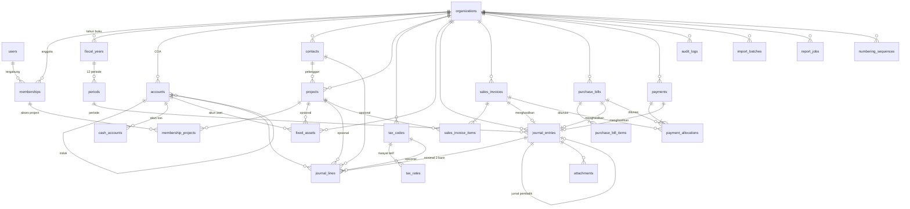

# Model Data — Menara Kas

PostgreSQL 16. Seluruh DDL di dokumen ini adalah acuan; implementasinya ditulis sebagai berkas migrasi SQL di `lib/db/migrations/` dan diakses lewat `pg` (node-postgres), tanpa ORM.

---

## 1. Keputusan dasar

1. **Satu sumber kebenaran: `journal_lines`.** Semua laporan, tanpa kecuali, dihitung dari tabel ini. Tidak ada tabel saldo yang diisi manual dan tidak ada angka yang disimpan ganda.
2. **Project ada di level baris jurnal, bukan di level transaksi.** Inilah yang memungkinkan satu pembayaran dibagi ke beberapa project tanpa mengorbankan keseimbangan jurnal.
3. **Transaksi terposting bersifat tetap.** Koreksi dilakukan dengan jurnal pembalik. Tidak ada `UPDATE` pada jurnal terposting.
4. **Uang disimpan `numeric(18,2)`.** Tidak pernah `float` atau `double precision`. Di sisi aplikasi, uang diproses sebagai bilangan bulat rupiah sen (`bigint`) lalu dikonversi di batas basis data.
5. **Isolasi antar perusahaan ganda.** Kolom `org_id` ada di setiap tabel data, setiap query wajib menyebutkannya, dan Row Level Security dipasang sebagai jaring pengaman kedua.
6. **Dokumen sumber terpisah dari jurnal.** Invoice, tagihan, dan pembayaran punya tabelnya sendiri, lalu mesin posting menerjemahkannya menjadi satu jurnal. Jurnal tidak pernah dibentuk di dua tempat berbeda.

---

## 2. ERD



---

## 3. Tipe enum

```sql
CREATE TYPE account_group AS ENUM (
  'ASET', 'LIABILITAS', 'EKUITAS',
  'PENDAPATAN', 'BEBAN_POKOK_PROJECT', 'BEBAN_OPERASIONAL', 'LAIN_LAIN'
);

CREATE TYPE normal_balance AS ENUM ('DEBIT', 'KREDIT');

CREATE TYPE cash_flow_class AS ENUM ('OPERASI', 'INVESTASI', 'PENDANAAN', 'BUKAN_ARUS_KAS');

CREATE TYPE member_role AS ENUM ('OWNER', 'ADMIN_KEUANGAN', 'STAF_INPUT', 'MANAJER_PROJECT');

CREATE TYPE period_status AS ENUM ('TERBUKA', 'TERKUNCI', 'DITUTUP');

CREATE TYPE entry_status AS ENUM ('DRAFT', 'TERPOSTING', 'DIBATALKAN');

CREATE TYPE entry_source AS ENUM (
  'JURNAL_UMUM', 'JURNAL_PENYESUAIAN', 'KAS_MASUK', 'KAS_KELUAR', 'TRANSFER_KAS',
  'INVOICE_PENJUALAN', 'TAGIHAN_PEMBELIAN', 'TERIMA_PEMBAYARAN', 'BAYAR_TAGIHAN',
  'DEPRESIASI', 'SALDO_AWAL', 'JURNAL_PENUTUP', 'JURNAL_PEMBALIK'
);

CREATE TYPE project_status AS ENUM (
  'QUOTATION', 'BERJALAN', 'SERAH_TERIMA', 'INVOICING', 'SELESAI', 'DIBATALKAN'
);

CREATE TYPE tax_kind AS ENUM (
  'PPN_KELUARAN', 'PPN_MASUKAN', 'PPH_21', 'PPH_22', 'PPH_23', 'PPH_4_2', 'NON_PAJAK'
);

CREATE TYPE tax_treatment AS ENUM ('TERMASUK_PPN', 'BELUM_TERMASUK_PPN', 'NON_PPN');

CREATE TYPE payment_direction AS ENUM ('MASUK', 'KELUAR');
```

Nilai enum memakai bahasa Indonesia karena istilah akuntansi Indonesia tidak punya padanan Inggris yang satu lawan satu, terutama `BEBAN_POKOK_PROJECT` dan `PPH_4_2`. Ini pengecualian yang disengaja terhadap aturan "kode berbahasa Inggris" di [AGENTS.md](../AGENTS.md).

---

## 4. Tabel

DDL di bawah dikelompokkan menurut tema agar mudah dibaca, sehingga beberapa `REFERENCES` menunjuk tabel yang baru muncul di bagian berikutnya. Urutan sebenarnya diatur oleh migrasi.

### 4.1 Identitas dan organisasi

```sql
CREATE TABLE users (
  id            uuid PRIMARY KEY DEFAULT gen_random_uuid(),
  email         citext NOT NULL UNIQUE,
  name          text NOT NULL,
  password_hash text NOT NULL,
  email_verified_at timestamptz,
  created_at    timestamptz NOT NULL DEFAULT now()
);

CREATE TABLE organizations (
  id            uuid PRIMARY KEY DEFAULT gen_random_uuid(),
  name          text NOT NULL,
  company_code  text NOT NULL,          -- dipakai di nomor QT/INV/BA/KW, contoh 'MMS'
  npwp          text,
  address       text,
  phone         text,
  email         text,
  logo_key      text,
  bank_account_label text,             -- rekening default di dokumen cetak
  fiscal_year_start_month smallint NOT NULL DEFAULT 1
    CHECK (fiscal_year_start_month BETWEEN 1 AND 12),
  require_project_groups account_group[] NOT NULL
    DEFAULT ARRAY['PENDAPATAN','BEBAN_POKOK_PROJECT']::account_group[],
  created_at    timestamptz NOT NULL DEFAULT now(),
  UNIQUE (company_code),
  CHECK (company_code ~ '^[A-Z0-9]{2,6}$')
);

CREATE TABLE memberships (
  id        uuid PRIMARY KEY DEFAULT gen_random_uuid(),
  org_id    uuid NOT NULL REFERENCES organizations ON DELETE CASCADE,
  user_id   uuid NOT NULL REFERENCES users ON DELETE CASCADE,
  role      member_role NOT NULL,
  is_active boolean NOT NULL DEFAULT true,
  created_at timestamptz NOT NULL DEFAULT now(),
  UNIQUE (org_id, user_id)
);

CREATE TABLE membership_projects (
  membership_id uuid NOT NULL REFERENCES memberships ON DELETE CASCADE,
  project_id    uuid NOT NULL REFERENCES projects ON DELETE CASCADE,
  PRIMARY KEY (membership_id, project_id)
);
```

`require_project_groups` menyimpan golongan akun yang wajib punya project (kebutuhan M4-2). Golongan yang tidak boleh masuk daftar ini, yaitu `ASET`, `LIABILITAS`, dan `EKUITAS`, divalidasi di aplikasi karena `CHECK` pada isi array menjadi sulit dibaca.

### 4.2 Tahun buku dan periode

```sql
CREATE TABLE fiscal_years (
  id        uuid PRIMARY KEY DEFAULT gen_random_uuid(),
  org_id    uuid NOT NULL REFERENCES organizations ON DELETE CASCADE,
  year      smallint NOT NULL,
  is_closed boolean NOT NULL DEFAULT false,
  closed_at timestamptz,
  closing_entry_id uuid,
  UNIQUE (org_id, year)
);

CREATE TABLE periods (
  id             uuid PRIMARY KEY DEFAULT gen_random_uuid(),
  org_id         uuid NOT NULL REFERENCES organizations ON DELETE CASCADE,
  fiscal_year_id uuid NOT NULL REFERENCES fiscal_years ON DELETE CASCADE,
  year           smallint NOT NULL,
  month          smallint NOT NULL CHECK (month BETWEEN 1 AND 12),
  start_date     date NOT NULL,
  end_date       date NOT NULL,
  status         period_status NOT NULL DEFAULT 'TERBUKA',
  locked_at      timestamptz,
  locked_by      uuid REFERENCES users,
  UNIQUE (org_id, year, month)
);
```

### 4.3 Chart of Account

```sql
CREATE TABLE accounts (
  id              uuid PRIMARY KEY DEFAULT gen_random_uuid(),
  org_id          uuid NOT NULL REFERENCES organizations ON DELETE CASCADE,
  account_no      text NOT NULL,
  name            text NOT NULL,
  "group"         account_group NOT NULL,
  normal_balance  normal_balance NOT NULL,
  cash_flow_class cash_flow_class NOT NULL DEFAULT 'OPERASI',
  parent_id       uuid REFERENCES accounts ON DELETE RESTRICT,
  depth           smallint NOT NULL DEFAULT 1 CHECK (depth BETWEEN 1 AND 3),
  is_postable     boolean NOT NULL DEFAULT true,
  is_cash         boolean NOT NULL DEFAULT false,
  is_active       boolean NOT NULL DEFAULT true,
  is_system       boolean NOT NULL DEFAULT false,
  sort_key        text NOT NULL,
  created_at      timestamptz NOT NULL DEFAULT now(),
  UNIQUE (org_id, account_no)
);

CREATE INDEX accounts_org_group_idx ON accounts (org_id, "group", sort_key);
CREATE INDEX accounts_org_cash_idx  ON accounts (org_id) WHERE is_cash;
```

Catatan kolom:
- `is_postable` bernilai `false` untuk akun induk. Mesin posting menolak baris yang menunjuk akun tidak postable.
- `is_cash` menandai akun kas dan bank. Kolom ini yang membuat laporan arus kas mungkin dihitung.
- `is_system` menandai akun yang tidak boleh dihapus atau diubah golongannya, misalnya Laba Ditahan, Utang PPN Keluaran, dan Piutang Usaha, karena mesin posting merujuknya.
- `sort_key` adalah nomor akun yang sudah dinormalkan untuk pengurutan (`5-1100` menjadi `5.1100`), supaya urutan laporan tidak bergantung pada urutan teks mentah.

Organisasi menyimpan pemetaan akun sistem pada tabel terpisah agar mesin posting tidak menebak nomor akun:

```sql
CREATE TABLE account_roles (
  org_id     uuid NOT NULL REFERENCES organizations ON DELETE CASCADE,
  role       text NOT NULL,   -- 'PIUTANG_USAHA', 'UTANG_USAHA', 'PPN_KELUARAN',
                              -- 'PPN_MASUKAN', 'PIUTANG_RETENSI', 'LABA_DITAHAN',
                              -- 'IKHTISAR_LABA_RUGI', ...
  account_id uuid NOT NULL REFERENCES accounts ON DELETE RESTRICT,
  PRIMARY KEY (org_id, role)
);
```

### 4.4 Kontak, project, kas

```sql
CREATE TABLE contacts (
  id           uuid PRIMARY KEY DEFAULT gen_random_uuid(),
  org_id       uuid NOT NULL REFERENCES organizations ON DELETE CASCADE,
  code         text,
  name         text NOT NULL,
  is_customer  boolean NOT NULL DEFAULT false,
  is_vendor    boolean NOT NULL DEFAULT false,
  is_employee  boolean NOT NULL DEFAULT false,
  npwp         text,
  address      text,
  phone        text,
  email        citext,
  is_active    boolean NOT NULL DEFAULT true,
  created_at   timestamptz NOT NULL DEFAULT now(),
  UNIQUE (org_id, code)
);

CREATE TABLE projects (
  id             uuid PRIMARY KEY DEFAULT gen_random_uuid(),
  org_id         uuid NOT NULL REFERENCES organizations ON DELETE CASCADE,
  code           text NOT NULL,
  name           text NOT NULL,
  customer_id    uuid REFERENCES contacts ON DELETE RESTRICT,
  contract_value numeric(18,2) NOT NULL DEFAULT 0 CHECK (contract_value >= 0),
  start_date     date,
  target_end_date date,
  pic_name       text,
  status         project_status NOT NULL DEFAULT 'BERJALAN',
  notes          text,
  created_at     timestamptz NOT NULL DEFAULT now(),
  UNIQUE (org_id, code)
);

CREATE INDEX projects_org_status_idx ON projects (org_id, status, code);

CREATE TABLE cash_accounts (
  id             uuid PRIMARY KEY DEFAULT gen_random_uuid(),
  org_id         uuid NOT NULL REFERENCES organizations ON DELETE CASCADE,
  account_id     uuid NOT NULL UNIQUE REFERENCES accounts ON DELETE RESTRICT,
  label          text NOT NULL,
  bank_name      text,
  account_number text,
  account_holder text,
  is_active      boolean NOT NULL DEFAULT true
);
```

`cash_accounts.account_id` bersifat `UNIQUE` sehingga satu rekening tepat memetakan satu akun COA (kebutuhan M2-4). Saldo tidak disimpan di tabel ini; saldo selalu dihitung dari `journal_lines`.

### 4.5 Pajak

```sql
CREATE TABLE tax_codes (
  id         uuid PRIMARY KEY DEFAULT gen_random_uuid(),
  org_id     uuid NOT NULL REFERENCES organizations ON DELETE CASCADE,
  code       text NOT NULL,
  name       text NOT NULL,
  kind       tax_kind NOT NULL,
  account_id uuid NOT NULL REFERENCES accounts ON DELETE RESTRICT,
  is_active  boolean NOT NULL DEFAULT true,
  UNIQUE (org_id, code)
);

CREATE TABLE tax_rates (
  id           uuid PRIMARY KEY DEFAULT gen_random_uuid(),
  tax_code_id  uuid NOT NULL REFERENCES tax_codes ON DELETE CASCADE,
  rate_percent numeric(6,3) NOT NULL CHECK (rate_percent >= 0 AND rate_percent <= 100),
  valid_from   date NOT NULL,
  valid_to     date,
  CHECK (valid_to IS NULL OR valid_to >= valid_from)
);

CREATE UNIQUE INDEX tax_rates_no_overlap
  ON tax_rates (tax_code_id, valid_from);
```

Tarif berbentuk riwayat bertanggal supaya transaksi lama tidak ikut berubah ketika tarif diperbarui (kebutuhan M2-6). Pemilihan tarif memakai tanggal transaksi, bukan tanggal hari ini.

### 4.6 Jurnal

Inti aplikasi.

```sql
CREATE TABLE journal_entries (
  id             uuid PRIMARY KEY DEFAULT gen_random_uuid(),
  org_id         uuid NOT NULL REFERENCES organizations ON DELETE CASCADE,
  entry_no       text NOT NULL,
  entry_date     date NOT NULL,
  period_id      uuid NOT NULL REFERENCES periods ON DELETE RESTRICT,
  source         entry_source NOT NULL,
  status         entry_status NOT NULL DEFAULT 'DRAFT',
  memo           text,
  has_cash_line  boolean NOT NULL DEFAULT false,
  total_amount   numeric(18,2) NOT NULL DEFAULT 0,
  reversal_of_id uuid REFERENCES journal_entries ON DELETE RESTRICT,
  import_batch_id uuid REFERENCES import_batches ON DELETE SET NULL,
  created_by     uuid NOT NULL REFERENCES users,
  created_at     timestamptz NOT NULL DEFAULT now(),
  posted_by      uuid REFERENCES users,
  posted_at      timestamptz,
  UNIQUE (org_id, entry_no),
  CHECK ((status = 'TERPOSTING') = (posted_at IS NOT NULL))
);

CREATE INDEX entries_org_date_idx   ON journal_entries (org_id, entry_date DESC, id);
CREATE INDEX entries_org_status_idx ON journal_entries (org_id, status) WHERE status = 'DRAFT';
CREATE INDEX entries_period_idx     ON journal_entries (period_id);

CREATE TABLE journal_lines (
  id          uuid PRIMARY KEY DEFAULT gen_random_uuid(),
  entry_id    uuid NOT NULL REFERENCES journal_entries ON DELETE CASCADE,
  line_no     smallint NOT NULL,

  -- disalin dari journal_entries agar laporan cukup memindai satu tabel
  org_id      uuid NOT NULL,
  entry_date  date NOT NULL,
  status      entry_status NOT NULL,

  account_id  uuid NOT NULL REFERENCES accounts ON DELETE RESTRICT,
  project_id  uuid REFERENCES projects ON DELETE RESTRICT,
  contact_id  uuid REFERENCES contacts ON DELETE RESTRICT,
  tax_code_id uuid REFERENCES tax_codes ON DELETE RESTRICT,

  debit       numeric(18,2) NOT NULL DEFAULT 0 CHECK (debit  >= 0),
  credit      numeric(18,2) NOT NULL DEFAULT 0 CHECK (credit >= 0),
  description text,

  UNIQUE (entry_id, line_no),
  CHECK (debit = 0 OR credit = 0),
  CHECK (debit + credit > 0)
);

CREATE INDEX lines_report_idx ON journal_lines (org_id, status, entry_date, account_id)
  INCLUDE (debit, credit);
CREATE INDEX lines_project_idx ON journal_lines (org_id, status, project_id, entry_date)
  INCLUDE (account_id, debit, credit) WHERE project_id IS NOT NULL;
CREATE INDEX lines_ledger_idx  ON journal_lines (org_id, account_id, entry_date, id);
CREATE INDEX lines_contact_idx ON journal_lines (org_id, contact_id, entry_date)
  WHERE contact_id IS NOT NULL;
CREATE INDEX lines_entry_idx   ON journal_lines (entry_id, line_no);
```

Tiga kolom pada `journal_lines` disalin dari `journal_entries`: `org_id`, `entry_date`, dan `status`. Ini denormalisasi yang disengaja, dengan alasan yang jelas: setiap laporan keuangan adalah agregasi atas baris, dan tanpa penyalinan ini setiap laporan harus melakukan join ke tabel entri hanya untuk menyaring tanggal dan status. Konsistensinya dijaga trigger, bukan kode aplikasi:

```sql
CREATE OR REPLACE FUNCTION sync_line_denorm() RETURNS trigger AS $$
BEGIN
  SELECT e.org_id, e.entry_date, e.status
    INTO NEW.org_id, NEW.entry_date, NEW.status
  FROM journal_entries e WHERE e.id = NEW.entry_id;
  RETURN NEW;
END $$ LANGUAGE plpgsql;

CREATE TRIGGER journal_lines_denorm
  BEFORE INSERT OR UPDATE OF entry_id ON journal_lines
  FOR EACH ROW EXECUTE FUNCTION sync_line_denorm();

CREATE OR REPLACE FUNCTION propagate_entry_change() RETURNS trigger AS $$
BEGIN
  IF NEW.status IS DISTINCT FROM OLD.status
     OR NEW.entry_date IS DISTINCT FROM OLD.entry_date THEN
    UPDATE journal_lines
       SET status = NEW.status, entry_date = NEW.entry_date
     WHERE entry_id = NEW.id;
  END IF;
  RETURN NEW;
END $$ LANGUAGE plpgsql;

CREATE TRIGGER journal_entries_propagate
  AFTER UPDATE ON journal_entries
  FOR EACH ROW EXECUTE FUNCTION propagate_entry_change();
```

### 4.7 Dokumen sumber dan dokumen project

```sql
CREATE TABLE quotations (
  id             uuid PRIMARY KEY DEFAULT gen_random_uuid(),
  org_id         uuid NOT NULL REFERENCES organizations ON DELETE CASCADE,
  document_no    text NOT NULL,          -- contoh 007/QT-MMS/09/2026
  seq_year       smallint NOT NULL,
  seq_no         integer NOT NULL,
  quote_date     date NOT NULL,
  valid_until    date,
  project_id     uuid REFERENCES projects ON DELETE RESTRICT,
  customer_id    uuid NOT NULL REFERENCES contacts ON DELETE RESTRICT,
  status         text NOT NULL DEFAULT 'DRAFT',
  subtotal       numeric(18,2) NOT NULL DEFAULT 0,
  discount       numeric(18,2) NOT NULL DEFAULT 0,
  tax_amount     numeric(18,2) NOT NULL DEFAULT 0,
  total          numeric(18,2) NOT NULL DEFAULT 0,
  notes          text,
  created_at     timestamptz NOT NULL DEFAULT now(),
  UNIQUE (org_id, document_no),
  UNIQUE (org_id, seq_year, seq_no)  -- seq per jenis di numbering_sequences prefix QT
);

CREATE TABLE quotation_items (
  id            uuid PRIMARY KEY DEFAULT gen_random_uuid(),
  quotation_id  uuid NOT NULL REFERENCES quotations ON DELETE CASCADE,
  line_no       smallint NOT NULL,
  description   text NOT NULL,
  quantity      numeric(14,3) NOT NULL DEFAULT 1,
  unit_price    numeric(18,2) NOT NULL,
  amount        numeric(18,2) NOT NULL,
  UNIQUE (quotation_id, line_no)
);

CREATE TABLE sales_invoices (
  id            uuid PRIMARY KEY DEFAULT gen_random_uuid(),
  org_id        uuid NOT NULL REFERENCES organizations ON DELETE CASCADE,
  document_no   text NOT NULL,          -- contoh 007/INV-MMS/09/2026
  seq_year      smallint NOT NULL,
  seq_no        integer NOT NULL,
  invoice_date  date NOT NULL,
  due_date      date NOT NULL,
  project_id    uuid REFERENCES projects ON DELETE RESTRICT,
  customer_id   uuid NOT NULL REFERENCES contacts ON DELETE RESTRICT,
  quotation_id  uuid REFERENCES quotations ON DELETE SET NULL,
  term_id       uuid,                   -- tautan ke project_terms, diisi setelah tabel itu
  tax_treatment tax_treatment NOT NULL DEFAULT 'BELUM_TERMASUK_PPN',
  tax_code_id   uuid REFERENCES tax_codes ON DELETE RESTRICT,
  tax_invoice_no text,
  subtotal      numeric(18,2) NOT NULL DEFAULT 0,
  discount      numeric(18,2) NOT NULL DEFAULT 0 CHECK (discount >= 0),
  tax_amount    numeric(18,2) NOT NULL DEFAULT 0 CHECK (tax_amount >= 0),
  retention_amount numeric(18,2) NOT NULL DEFAULT 0 CHECK (retention_amount >= 0),
  total         numeric(18,2) NOT NULL DEFAULT 0 CHECK (total >= 0),
  notes         text,
  entry_id      uuid REFERENCES journal_entries ON DELETE RESTRICT,
  created_at    timestamptz NOT NULL DEFAULT now(),
  UNIQUE (org_id, document_no),
  UNIQUE (org_id, seq_year, seq_no),
  CHECK (due_date >= invoice_date)
);

CREATE TABLE sales_invoice_items (
  id          uuid PRIMARY KEY DEFAULT gen_random_uuid(),
  invoice_id  uuid NOT NULL REFERENCES sales_invoices ON DELETE CASCADE,
  line_no     smallint NOT NULL,
  description text NOT NULL,
  project_id  uuid REFERENCES projects ON DELETE RESTRICT,
  account_id  uuid NOT NULL REFERENCES accounts ON DELETE RESTRICT,
  quantity    numeric(14,3) NOT NULL DEFAULT 1 CHECK (quantity > 0),
  unit_price  numeric(18,2) NOT NULL CHECK (unit_price >= 0),
  amount      numeric(18,2) NOT NULL CHECK (amount >= 0),
  UNIQUE (invoice_id, line_no)
);

CREATE TABLE berita_acara (
  id            uuid PRIMARY KEY DEFAULT gen_random_uuid(),
  org_id        uuid NOT NULL REFERENCES organizations ON DELETE CASCADE,
  document_no   text NOT NULL,
  seq_year      smallint NOT NULL,
  seq_no        integer NOT NULL,
  ba_date       date NOT NULL,
  project_id    uuid NOT NULL REFERENCES projects ON DELETE RESTRICT,
  customer_id   uuid NOT NULL REFERENCES contacts ON DELETE RESTRICT,
  invoice_id    uuid REFERENCES sales_invoices ON DELETE SET NULL,
  description   text NOT NULL,
  acknowledged_value numeric(18,2),
  signatory_client text,
  signatory_ours   text,
  status        text NOT NULL DEFAULT 'DRAFT',
  notes         text,
  created_at    timestamptz NOT NULL DEFAULT now(),
  UNIQUE (org_id, document_no),
  UNIQUE (org_id, seq_year, seq_no)
);

CREATE TABLE kwitansi (
  id            uuid PRIMARY KEY DEFAULT gen_random_uuid(),
  org_id        uuid NOT NULL REFERENCES organizations ON DELETE CASCADE,
  document_no   text NOT NULL,
  seq_year      smallint NOT NULL,
  seq_no        integer NOT NULL,
  kw_date       date NOT NULL,
  project_id    uuid REFERENCES projects ON DELETE RESTRICT,
  contact_id    uuid NOT NULL REFERENCES contacts ON DELETE RESTRICT,
  payment_id    uuid,                   -- tautan ke payments bila dari pembayaran
  description   text NOT NULL,
  amount        numeric(18,2) NOT NULL CHECK (amount > 0),
  payment_method text,
  created_at    timestamptz NOT NULL DEFAULT now(),
  UNIQUE (org_id, document_no),
  UNIQUE (org_id, seq_year, seq_no)
);

CREATE TABLE project_terms (
  id            uuid PRIMARY KEY DEFAULT gen_random_uuid(),
  org_id        uuid NOT NULL REFERENCES organizations ON DELETE CASCADE,
  project_id    uuid NOT NULL REFERENCES projects ON DELETE CASCADE,
  term_no       smallint NOT NULL,
  name          text NOT NULL,
  percent       numeric(6,3),
  amount        numeric(18,2) NOT NULL CHECK (amount >= 0),
  planned_date  date,
  status        text NOT NULL DEFAULT 'RENCANA',
  invoice_id    uuid REFERENCES sales_invoices ON DELETE SET NULL,
  ba_id         uuid REFERENCES berita_acara ON DELETE SET NULL,
  UNIQUE (project_id, term_no)
);

CREATE TABLE performance_bonds (
  id            uuid PRIMARY KEY DEFAULT gen_random_uuid(),
  org_id        uuid NOT NULL REFERENCES organizations ON DELETE CASCADE,
  project_id    uuid NOT NULL REFERENCES projects ON DELETE RESTRICT,
  kind          text NOT NULL,          -- 'PELAKSANAAN', 'UANG_MUKA', 'PEMELIHARAAN'
  bond_no       text NOT NULL,
  issuer        text NOT NULL,
  amount        numeric(18,2) NOT NULL CHECK (amount > 0),
  issued_on     date NOT NULL,
  expires_on    date NOT NULL,
  status        text NOT NULL DEFAULT 'AKTIF',
  notes         text,
  UNIQUE (org_id, bond_no),
  CHECK (expires_on >= issued_on)
);
```

Quotation dan Berita Acara **tidak** membuat jurnal. Invoice dan pembayaran yang membuat jurnal.

```sql
CREATE TABLE payments (
  id           uuid PRIMARY KEY DEFAULT gen_random_uuid(),
  org_id       uuid NOT NULL REFERENCES organizations ON DELETE CASCADE,
  payment_no   text NOT NULL,
  payment_date date NOT NULL,
  direction    payment_direction NOT NULL,
  cash_account_id uuid NOT NULL REFERENCES cash_accounts ON DELETE RESTRICT,
  contact_id   uuid REFERENCES contacts ON DELETE RESTRICT,
  gross_amount numeric(18,2) NOT NULL CHECK (gross_amount > 0),
  cash_amount  numeric(18,2) NOT NULL CHECK (cash_amount > 0),
  notes        text,
  entry_id     uuid REFERENCES journal_entries ON DELETE RESTRICT,
  created_at   timestamptz NOT NULL DEFAULT now(),
  UNIQUE (org_id, payment_no)
);

CREATE TABLE payment_withholdings (
  id           uuid PRIMARY KEY DEFAULT gen_random_uuid(),
  payment_id   uuid NOT NULL REFERENCES payments ON DELETE CASCADE,
  tax_code_id  uuid NOT NULL REFERENCES tax_codes ON DELETE RESTRICT,
  base_amount  numeric(18,2) NOT NULL CHECK (base_amount >= 0),
  rate_percent numeric(6,3) NOT NULL,
  amount       numeric(18,2) NOT NULL CHECK (amount >= 0),
  slip_no      text
);

CREATE TABLE payment_allocations (
  id          uuid PRIMARY KEY DEFAULT gen_random_uuid(),
  payment_id  uuid NOT NULL REFERENCES payments ON DELETE CASCADE,
  invoice_id  uuid REFERENCES sales_invoices ON DELETE RESTRICT,
  bill_id     uuid REFERENCES purchase_bills ON DELETE RESTRICT,
  amount      numeric(18,2) NOT NULL CHECK (amount > 0),
  CHECK ((invoice_id IS NULL) <> (bill_id IS NULL))
);
```

`purchase_bills` dan `purchase_bill_items` memakai struktur yang sama dengan sisi penjualan, dengan `vendor_id` dan akun beban atau aset pada setiap item.

`gross_amount` adalah nilai piutang atau utang yang dilunasi, sedangkan `cash_amount` adalah kas yang benar-benar bergerak. Selisih keduanya wajib sama dengan total `payment_withholdings`. Dua kolom ini dipisah karena pemotongan PPh membuat kas yang diterima lebih kecil dari piutang yang lunas, dan menyimpan hanya satu angka akan membuat rekonsiliasi piutang gagal.

### 4.8 Aset tetap

```sql
CREATE TABLE fixed_assets (
  id             uuid PRIMARY KEY DEFAULT gen_random_uuid(),
  org_id         uuid NOT NULL REFERENCES organizations ON DELETE CASCADE,
  code           text NOT NULL,
  name           text NOT NULL,
  acquired_on    date NOT NULL,
  cost           numeric(18,2) NOT NULL CHECK (cost > 0),
  residual_value numeric(18,2) NOT NULL DEFAULT 0 CHECK (residual_value >= 0),
  useful_months  smallint NOT NULL CHECK (useful_months > 0),
  asset_account_id        uuid NOT NULL REFERENCES accounts ON DELETE RESTRICT,
  accum_depr_account_id   uuid NOT NULL REFERENCES accounts ON DELETE RESTRICT,
  depr_expense_account_id uuid NOT NULL REFERENCES accounts ON DELETE RESTRICT,
  project_id     uuid REFERENCES projects ON DELETE RESTRICT,
  disposed_on    date,
  UNIQUE (org_id, code),
  CHECK (residual_value < cost)
);

CREATE TABLE depreciation_runs (
  id        uuid PRIMARY KEY DEFAULT gen_random_uuid(),
  org_id    uuid NOT NULL REFERENCES organizations ON DELETE CASCADE,
  year      smallint NOT NULL,
  month     smallint NOT NULL CHECK (month BETWEEN 1 AND 12),
  entry_id  uuid NOT NULL REFERENCES journal_entries ON DELETE RESTRICT,
  created_at timestamptz NOT NULL DEFAULT now(),
  UNIQUE (org_id, year, month)
);
```

`UNIQUE (org_id, year, month)` pada `depreciation_runs` adalah cara paling murah menegakkan aturan "posting depresiasi bulan yang sama dua kali ditolak" (kebutuhan M2-5). Aturan ini ditegakkan basis data, bukan pemeriksaan di aplikasi yang bisa lolos saat ada dua permintaan bersamaan.

Beban depresiasi bulanan garis lurus dihitung, tidak disimpan:

```
beban_per_bulan = round((cost - residual_value) / useful_months)
```

Pembulatan sisa dibebankan pada bulan terakhir masa manfaat agar total akumulasi tepat sama dengan `cost - residual_value`.

### 4.9 Penunjang

```sql
CREATE TABLE attachments (
  id          uuid PRIMARY KEY DEFAULT gen_random_uuid(),
  org_id      uuid NOT NULL REFERENCES organizations ON DELETE CASCADE,
  entry_id    uuid REFERENCES journal_entries ON DELETE CASCADE,
  file_key    text NOT NULL,
  file_name   text NOT NULL,
  mime_type   text NOT NULL,
  size_bytes  integer NOT NULL CHECK (size_bytes > 0 AND size_bytes <= 10485760),
  uploaded_by uuid NOT NULL REFERENCES users,
  uploaded_at timestamptz NOT NULL DEFAULT now()
);

CREATE TABLE audit_logs (
  id          bigserial PRIMARY KEY,
  org_id      uuid NOT NULL REFERENCES organizations ON DELETE CASCADE,
  user_id     uuid REFERENCES users,
  action      text NOT NULL,          -- 'ENTRY_POSTED', 'PERIOD_UNLOCKED', ...
  entity_type text NOT NULL,
  entity_id   uuid,
  before      jsonb,
  after       jsonb,
  ip_address  inet,
  created_at  timestamptz NOT NULL DEFAULT now()
);

CREATE INDEX audit_org_time_idx ON audit_logs (org_id, created_at DESC);

CREATE TABLE numbering_sequences (
  org_id     uuid NOT NULL REFERENCES organizations ON DELETE CASCADE,
  prefix     text NOT NULL,           -- 'KK','KM','JU','QT','INV','BA','KW',...
  year       smallint NOT NULL,
  last_value integer NOT NULL DEFAULT 0,
  PRIMARY KEY (org_id, prefix, year)
);

CREATE TABLE import_batches (
  id          uuid PRIMARY KEY DEFAULT gen_random_uuid(),
  org_id      uuid NOT NULL REFERENCES organizations ON DELETE CASCADE,
  file_name   text NOT NULL,
  kind        text NOT NULL,          -- 'TRANSAKSI', 'COA', 'KONTAK', 'PROJECT'
  row_count   integer NOT NULL,
  created_by  uuid NOT NULL REFERENCES users,
  created_at  timestamptz NOT NULL DEFAULT now()
);

CREATE TABLE report_jobs (
  id           uuid PRIMARY KEY DEFAULT gen_random_uuid(),
  org_id       uuid NOT NULL REFERENCES organizations ON DELETE CASCADE,
  kind         text NOT NULL,          -- 'PAKET_BULANAN', 'PAKET_TAHUNAN'
  params       jsonb NOT NULL,
  status       text NOT NULL DEFAULT 'MENUNGGU',
  file_key     text,
  error_message text,
  requested_by uuid NOT NULL REFERENCES users,
  created_at   timestamptz NOT NULL DEFAULT now(),
  finished_at  timestamptz
);
```

Nomor jurnal transaksi (`KK-2026-0001`) dan nomor dokumen formal (`007/INV-MMS/09/2026`) memakai tabel yang sama, beda prefix.

Format nomor dokumen formal (QT, INV, BA, KW):

```
{seq_no padded 3}/{PREFIX}-{company_code}/{MM}/{YYYY}
```

Contoh: `007/INV-MMS/09/2026`. `seq_no` berlanjut sepanjang tahun kalender per prefix, mengulang dari 1 setiap 1 Januari. `company_code` diambil dari `organizations.company_code`.

```sql
INSERT INTO numbering_sequences (org_id, prefix, year, last_value)
VALUES ($1, $2, $3, 1)
ON CONFLICT (org_id, prefix, year)
DO UPDATE SET last_value = numbering_sequences.last_value + 1
RETURNING last_value;
```

---

## 5. Invariant akuntansi

Delapan aturan berikut adalah definisi "benar" bagi aplikasi ini. Masing-masing ditegakkan di basis data atau mesin posting, dan masing-masing punya tes otomatis yang wajib lulus di CI.

### I1 — Setiap jurnal seimbang

Total debit sama dengan total kredit pada setiap entri. Ditegakkan `CONSTRAINT TRIGGER` yang ditunda sampai akhir transaksi, sehingga penyisipan baris satu per satu tidak memicu kegagalan palsu.

```sql
CREATE OR REPLACE FUNCTION assert_entry_balanced() RETURNS trigger AS $$
DECLARE
  v_entry uuid := COALESCE(NEW.entry_id, OLD.entry_id);
  v_debit  numeric(18,2);
  v_credit numeric(18,2);
  v_count  integer;
BEGIN
  SELECT COALESCE(SUM(debit),0), COALESCE(SUM(credit),0), COUNT(*)
    INTO v_debit, v_credit, v_count
  FROM journal_lines WHERE entry_id = v_entry;

  IF v_count = 0 THEN
    RETURN NULL;                         -- entri dihapus, tidak ada yang diperiksa
  END IF;
  IF v_count < 2 THEN
    RAISE EXCEPTION 'Jurnal % harus punya minimal 2 baris', v_entry;
  END IF;
  IF v_debit <> v_credit THEN
    RAISE EXCEPTION 'Jurnal % tidak seimbang: debit %, kredit %',
      v_entry, v_debit, v_credit;
  END IF;
  RETURN NULL;
END $$ LANGUAGE plpgsql;

CREATE CONSTRAINT TRIGGER journal_lines_balanced
  AFTER INSERT OR UPDATE OR DELETE ON journal_lines
  DEFERRABLE INITIALLY DEFERRED
  FOR EACH ROW EXECUTE FUNCTION assert_entry_balanced();
```

### I2 — Satu baris hanya debit atau kredit

`CHECK (debit = 0 OR credit = 0)` dan `CHECK (debit + credit > 0)` pada `journal_lines`.

### I3 — Periode terkunci menolak perubahan

Trigger pada `journal_entries` menolak `INSERT`, `UPDATE`, dan `DELETE` jika periode tujuan tidak berstatus `TERBUKA`.

```sql
CREATE OR REPLACE FUNCTION assert_period_open() RETURNS trigger AS $$
DECLARE v_status period_status;
BEGIN
  SELECT status INTO v_status FROM periods
   WHERE id = COALESCE(NEW.period_id, OLD.period_id);
  IF v_status <> 'TERBUKA' THEN
    RAISE EXCEPTION 'Periode sudah % dan tidak menerima perubahan transaksi', v_status;
  END IF;
  RETURN COALESCE(NEW, OLD);
END $$ LANGUAGE plpgsql;
```

Pengecualian tunggal: jurnal penutup yang dibuat proses tutup buku, yang berjalan dengan menyetel `SET LOCAL app.closing = 'on'` dan diperiksa di dalam trigger.

### I4 — Transaksi terposting tidak berubah

Trigger menolak `UPDATE` pada `journal_entries` berstatus `TERPOSTING` kecuali perubahan menuju `DIBATALKAN` yang disertai `reversal_of_id` pada entri pembalik. `journal_lines` milik entri terposting menolak `UPDATE` dan `DELETE` sepenuhnya.

### I5 — Akun induk tidak bisa dijurnal

Mesin posting dan `CHECK` melalui trigger menolak baris yang menunjuk akun dengan `is_postable = false` atau `is_active = false`.

### I6 — Project wajib pada golongan akun tertentu

Saat posting, setiap baris yang akunnya bergolongan anggota `organizations.require_project_groups` wajib punya `project_id`. Ditegakkan mesin posting dengan pesan yang menyebut nomor baris dan nomor akun.

### I7 — Neraca selalu seimbang

Turunan dari I1, tetapi diuji terpisah karena ini yang dilihat pengguna:

```sql
-- harus mengembalikan 0
SELECT COALESCE(SUM(
  CASE WHEN a."group" IN ('ASET') THEN l.debit - l.credit
       ELSE l.credit - l.debit END
), 0)
FROM journal_lines l
JOIN accounts a ON a.id = l.account_id
WHERE l.org_id = $1
  AND l.status = 'TERPOSTING'
  AND l.entry_date <= $2
  AND a."group" IN ('ASET','LIABILITAS','EKUITAS','PENDAPATAN',
                    'BEBAN_POKOK_PROJECT','BEBAN_OPERASIONAL','LAIN_LAIN');
```

### I8 — Total laporan project sama dengan laporan perusahaan

Jumlah Pendapatan dan Beban Pokok Project seluruh project, ditambah baris "Tidak Ditandai Project", wajib sama dengan angka Laba Rugi perusahaan pada periode yang sama. Ini tes otomatis wajib, karena invariant inilah yang membuat laporan project bisa dipercaya.

---

## 6. Laporan project

Bagian ini menjelaskan mekanisme yang paling mudah disalahpahami dalam aplikasi ini. Baca sampai habis sebelum menulis satu baris kode laporan.

### 6.1 Laba Rugi per project: langsung

Laba rugi project adalah penjumlahan biasa atas baris jurnal yang tertandai project tersebut, terbatas pada akun bergolongan `PENDAPATAN` dan `BEBAN_POKOK_PROJECT`.

```sql
SELECT a."group", a.account_no, a.name,
       SUM(l.credit - l.debit) AS nilai   -- pendapatan positif, beban negatif
FROM journal_lines l
JOIN accounts a ON a.id = l.account_id
WHERE l.org_id = $1
  AND l.status = 'TERPOSTING'
  AND l.project_id = $2
  AND l.entry_date BETWEEN $3 AND $4
  AND a."group" IN ('PENDAPATAN','BEBAN_POKOK_PROJECT')
GROUP BY a."group", a.account_no, a.name
ORDER BY a.account_no;
```

Beban bergolongan `BEBAN_OPERASIONAL` sengaja tidak masuk. MVP tidak mengalokasikan overhead ke project, dan laporan menyatakan hal itu secara eksplisit.

### 6.2 Arus Kas per project: lewat baris lawan

Arus kas tidak bisa dihitung dengan cara yang sama, karena baris kas dan bank tidak punya project. Yang tertandai project adalah baris lawannya.

Dasarnya satu identitas: pada setiap jurnal yang seimbang,

```
Σ (debit − kredit) seluruh baris = 0
```

sehingga

```
Σ (debit − kredit) baris kas  =  Σ (kredit − debit) baris bukan kas
```

Ruas kiri adalah pergerakan kas. Ruas kanan adalah penjumlahan per baris bukan kas, dan setiap baris bukan kas punya `project_id` sendiri. Artinya pergerakan kas bisa dibagi ke project **secara tepat, tanpa proporsi dan tanpa pembulatan**, cukup dengan mengelompokkan `kredit − debit` baris bukan kas menurut `project_id`.

```sql
SELECT l.project_id,
       a.account_no, a.name,
       SUM(l.credit - l.debit) AS arus_kas   -- positif = kas masuk
FROM journal_lines l
JOIN journal_entries e ON e.id = l.entry_id
JOIN accounts a ON a.id = l.account_id
WHERE l.org_id = $1
  AND l.status = 'TERPOSTING'
  AND l.entry_date BETWEEN $2 AND $3
  AND e.has_cash_line                  -- hanya jurnal yang menyentuh kas
  AND a.is_cash = false                -- baris lawan, bukan baris kas
GROUP BY l.project_id, a.account_no, a.name
ORDER BY l.project_id, a.account_no;
```

Dua penyaring terakhir adalah kunci laporan ini:
- `e.has_cash_line` membuang jurnal yang tidak menyentuh kas, misalnya invoice yang belum dibayar dan depresiasi. Tanpa penyaring ini totalnya tetap benar, karena jurnal tanpa kas berjumlah nol, tetapi laporan akan penuh baris yang membingungkan.
- `a.is_cash = false` membuang baris kas itu sendiri agar tidak dihitung dua kali.

Kolom `journal_entries.has_cash_line` diisi mesin posting pada saat posting, dan tidak pernah diubah setelahnya karena jurnal terposting bersifat tetap.

### 6.3 Mengapa baris piutang dipecah antara project dan pajak

Konsekuensi dari mekanisme di atas: agar kas dari pelunasan invoice sampai ke project yang benar, baris Piutang Usaha harus punya `project_id`. Mesin posting karena itu membentuk baris piutang **satu per project, ditambah satu baris tanpa project untuk porsi PPN**.

Aturannya:

```
baris piutang per project  = Σ nilai item invoice pada project tersebut
baris piutang tanpa project = nilai PPN invoice
```

PPN tidak pernah tertandai project karena PPN bukan uang project, melainkan titipan yang harus disetor ke negara. Aturan yang sama berlaku pada sisi utang untuk tagihan pembelian.

Saat pembayaran sebagian, komposisi baris piutang pada jurnal pembayaran mengikuti komposisi baris piutang pada invoice, dibagi proporsional terhadap nilai yang dibayar. Pembagian memakai metode sisa terbesar sehingga jumlah pecahan selalu tepat sama dengan nilai pembayaran, tanpa selisih satu rupiah.

```ts
// lib/accounting/allocate.ts
export function allocateByWeights(total: bigint, weights: bigint[]): bigint[] {
  const weightSum = weights.reduce((a, b) => a + b, 0n);
  if (weightSum === 0n) throw new Error("Bobot alokasi tidak boleh nol seluruhnya");

  const base = weights.map((w) => (total * w) / weightSum);
  let remainder = total - base.reduce((a, b) => a + b, 0n);

  const order = weights
    .map((w, i) => ({ i, rest: (total * w) % weightSum }))
    .sort((a, b) => (b.rest > a.rest ? 1 : b.rest < a.rest ? -1 : a.i - b.i));

  const result = [...base];
  for (let k = 0; remainder > 0n; k++, remainder--) {
    result[order[k % order.length].i] += 1n;
  }
  return result;
}
```

### 6.4 Contoh angka lengkap

Project `PRJ-001 Renovasi Kantor BCA Sudirman`, nilai kontrak Rp 500.000.000. Contoh ini dipakai sebagai fixture pengujian dan sebagai data demo.

**T1. Invoice termin pertama `INV-2026-0007`.** DPP Rp 200.000.000, PPN 11 persen Rp 22.000.000, total Rp 222.000.000. `has_cash_line = false`.

| Akun | Project | Debit | Kredit |
|---|---|---|---|
| 1-1300 Piutang Usaha | PRJ-001 | 200.000.000 | |
| 1-1300 Piutang Usaha | – | 22.000.000 | |
| 4-1100 Pendapatan Jasa Konstruksi | PRJ-001 | | 200.000.000 |
| 2-1310 Utang PPN Keluaran | – | | 22.000.000 |

**T2. Pelunasan invoice, dipotong PPh Pasal 4 ayat 2 sebesar 2 persen dari DPP.** Kas diterima Rp 218.000.000. `has_cash_line = true`.

| Akun | Project | Debit | Kredit |
|---|---|---|---|
| 1-1200 Bank BCA *(akun kas)* | – | 218.000.000 | |
| 1-1450 Pajak Dibayar Dimuka PPh 4(2) | PRJ-001 | 4.000.000 | |
| 1-1300 Piutang Usaha | PRJ-001 | | 200.000.000 |
| 1-1300 Piutang Usaha | – | | 22.000.000 |

**T3. Pembelian material tunai.** Vendor non PKP, tanpa PPN. `has_cash_line = true`.

| Akun | Project | Debit | Kredit |
|---|---|---|---|
| 5-1100 Biaya Material | PRJ-001 | 80.000.000 | |
| 1-1200 Bank BCA *(akun kas)* | – | | 80.000.000 |

**T4. Pembayaran upah tukang.** `has_cash_line = true`.

| Akun | Project | Debit | Kredit |
|---|---|---|---|
| 5-1200 Biaya Upah Tukang | PRJ-001 | 45.000.000 | |
| 1-1200 Bank BCA *(akun kas)* | – | | 45.000.000 |

**T5. Sewa kantor bulanan.** Tidak bisa ditelusuri ke satu project. `has_cash_line = true`.

| Akun | Project | Debit | Kredit |
|---|---|---|---|
| 6-2100 Beban Sewa Kantor | – | 15.000.000 | |
| 1-1200 Bank BCA *(akun kas)* | – | | 15.000.000 |

#### Hasil: Arus Kas per Project

Dihitung dengan kueri bagian 6.2. T1 tidak ikut karena `has_cash_line = false`.

| | PRJ-001 | Tidak Ditandai Project | Total |
|---|---|---|---|
| Piutang Usaha (penerimaan dari pelanggan) | 200.000.000 | 22.000.000 | 222.000.000 |
| Pajak Dibayar Dimuka PPh 4(2) | (4.000.000) | – | (4.000.000) |
| Biaya Material | (80.000.000) | – | (80.000.000) |
| Biaya Upah Tukang | (45.000.000) | – | (45.000.000) |
| Beban Sewa Kantor | – | (15.000.000) | (15.000.000) |
| **Arus Kas Bersih** | **71.000.000** | **7.000.000** | **78.000.000** |

Verifikasi: mutasi Bank BCA adalah `+218.000.000 − 80.000.000 − 45.000.000 − 15.000.000 = +78.000.000`. Angka ini sama dengan kolom Total, dan inilah bentuk invariant I8 untuk laporan arus kas.

#### Hasil: Laba Rugi per Project

| | PRJ-001 |
|---|---|
| Pendapatan Jasa Konstruksi | 200.000.000 |
| Biaya Material | (80.000.000) |
| Biaya Upah Tukang | (45.000.000) |
| **Laba Kotor Project** | **75.000.000** |
| Marjin Kotor | 37,5 persen |

#### Pelajaran yang harus tercermin di UI

Arus kas bersih project Rp 71.000.000, sedangkan laba kotornya Rp 75.000.000. Selisih Rp 4.000.000 adalah PPh Pasal 4 ayat 2 yang dipotong pelanggan: uang itu benar-benar keluar dari kas project, tetapi bukan beban, melainkan pajak dibayar dimuka yang tercatat sebagai aset.

Karena itu halaman detail project harus menampilkan kedua angka bersebelahan dengan label yang jelas, bukan satu angka "keuntungan" yang ambigu. Ini keputusan produk, bukan detail teknis.

### 6.5 Ringkasan Portofolio Project

```sql
WITH pl AS (
  SELECT l.project_id,
         SUM(CASE WHEN a."group" = 'PENDAPATAN'
                  THEN l.credit - l.debit ELSE 0 END) AS pendapatan,
         SUM(CASE WHEN a."group" = 'BEBAN_POKOK_PROJECT'
                  THEN l.debit - l.credit ELSE 0 END) AS biaya
  FROM journal_lines l
  JOIN accounts a ON a.id = l.account_id
  WHERE l.org_id = $1 AND l.status = 'TERPOSTING'
    AND l.entry_date BETWEEN $2 AND $3
  GROUP BY l.project_id
),
kas AS (
  SELECT l.project_id, SUM(l.credit - l.debit) AS arus_kas
  FROM journal_lines l
  JOIN journal_entries e ON e.id = l.entry_id
  JOIN accounts a ON a.id = l.account_id
  WHERE l.org_id = $1 AND l.status = 'TERPOSTING'
    AND l.entry_date BETWEEN $2 AND $3
    AND e.has_cash_line AND a.is_cash = false
  GROUP BY l.project_id
)
SELECT p.code, p.name, p.status, p.contract_value,
       COALESCE(pl.pendapatan, 0) AS pendapatan,
       COALESCE(pl.biaya, 0)      AS biaya,
       COALESCE(pl.pendapatan, 0) - COALESCE(pl.biaya, 0) AS laba_kotor,
       COALESCE(kas.arus_kas, 0)  AS arus_kas_bersih
FROM pl
FULL JOIN kas ON kas.project_id = pl.project_id
LEFT JOIN projects p ON p.id = COALESCE(pl.project_id, kas.project_id)
WHERE p.id IS NOT NULL OR COALESCE(pl.project_id, kas.project_id) IS NULL
ORDER BY p.code NULLS LAST;
```

`FULL JOIN` diperlukan karena sebuah project bisa punya arus kas tanpa laba rugi pada periode tersebut, misalnya ketika hanya menerima uang muka. Baris dengan `project_id` bernilai `NULL` menjadi baris "Tidak Ditandai Project" yang wajib tampil.

---

## 7. Isolasi antar perusahaan

Dua lapis, dan keduanya wajib.

**Lapis satu, di aplikasi.** Tidak ada kode fitur yang boleh memanggil klien basis data secara langsung. Seluruh akses melewati satu pembungkus yang menerima konteks berisi `orgId` dan menyuntikkannya ke setiap kueri. Rinciannya di [docs/architecture.md](architecture.md).

**Lapis dua, di basis data.** Row Level Security pada setiap tabel ber-`org_id`:

```sql
ALTER TABLE journal_lines ENABLE ROW LEVEL SECURITY;

CREATE POLICY org_isolation ON journal_lines
  USING (org_id = current_setting('app.org_id', true)::uuid);
```

Setiap transaksi basis data dibuka dengan `SET LOCAL app.org_id = $1` yang nilainya berasal dari sesi terverifikasi, bukan dari parameter permintaan. Peran basis data yang dipakai aplikasi bukan pemilik tabel sehingga tidak bisa melewati kebijakan RLS.

Tes isolasi wajib: satu berkas tes yang membuat dua organisasi berisi data mirip, lalu memastikan setiap kueri laporan yang dijalankan dengan konteks organisasi pertama tidak mengembalikan satu baris pun milik organisasi kedua.

---

## 8. Performa

Pola akses laporan sudah diketahui sejak awal, karena itu indeks dirancang bersamaan dengan kueri, bukan setelah ada keluhan.

| Laporan | Indeks yang dipakai |
|---|---|
| Neraca, Laba Rugi, Neraca Saldo | `lines_report_idx (org_id, status, entry_date, account_id)` |
| Buku Besar satu akun | `lines_ledger_idx (org_id, account_id, entry_date, id)` |
| Laporan project | `lines_project_idx` parsial `WHERE project_id IS NOT NULL` |
| Hutang dan piutang per kontak | `lines_contact_idx` parsial `WHERE contact_id IS NOT NULL` |
| Daftar transaksi | `entries_org_date_idx` |

Aturan tambahan:
- Seluruh agregasi dilakukan di SQL. Mengambil ribuan baris lalu menjumlahkannya di JavaScript dilarang.
- Saldo awal periode dihitung dengan satu agregasi `entry_date < start_date`, bukan dengan menjumlahkan seluruh riwayat baris di aplikasi.
- Tabel ringkasan bulanan yang diperbarui saat posting **belum dibuat di MVP**, dan hanya boleh ditambahkan jika hasil pengukuran pada 200.000 baris menunjukkan laporan melewati ambang di PRD bagian 7. Menyimpan angka ganda tanpa kebutuhan yang terukur adalah cara tercepat membuat laporan yang tidak bisa direkonsiliasi.

---

## 9. Data awal

Setiap organisasi baru mendapat, dalam satu transaksi basis data:

1. Template Chart of Account sesuai pilihan (Jasa Konstruksi & Kontraktor, atau Jasa Konsultan & Agensi), termasuk penanda `is_cash`, `cash_flow_class`, dan `is_system`.
2. Isian `account_roles` lengkap untuk seluruh peran yang dibutuhkan mesin posting. Onboarding gagal jika ada peran yang belum terpetakan; aplikasi tidak boleh berjalan dengan pemetaan setengah jadi.
3. Kode pajak bawaan beserta tarif berlaku: PPN 11 persen, PPh 23 sebesar 2 persen, PPh 4 ayat 2 sebesar 2 persen, PPh 21 tanpa tarif default.
4. Tahun buku berjalan beserta 12 periode berstatus `TERBUKA`.
5. Satu akun kas bernama `Kas Kecil`.

Data demo untuk lingkungan pengembangan memakai skenario `PRJ-001` di bagian 6.4, ditambah dua project lain dengan marjin berbeda, salah satunya bermarjin negatif agar tabel "Project Perlu Perhatian" di dashboard bisa diuji dengan data nyata.
