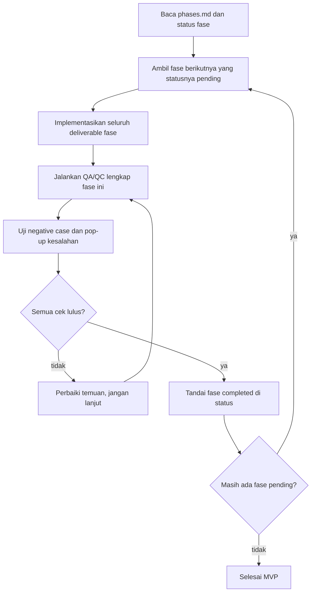
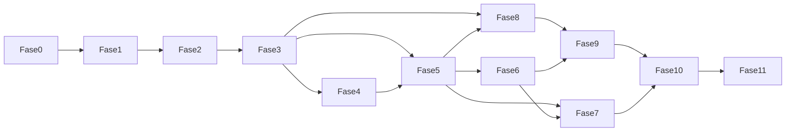

# Fase Pengerjaan — Menara Kas

Dokumen ini adalah instruksi operasional untuk agen AI (dan manusia) yang mengimplementasikan Menara Kas. **Bukan** dokumen produk. Baca dulu [docs/PRD.md](PRD.md), [docs/architecture.md](architecture.md), [docs/data-model.md](data-model.md), [docs/design-system.md](design-system.md), dan [AGENTS.md](../AGENTS.md).

---

## 1. Cara kerja otomatis



### Aturan wajib untuk agen AI

1. **Satu fase per putaran kerja.** Jangan menggabungkan dua fase dalam satu sesi implementasi.
2. **Setelah kode fase selesai, wajib QA/QC** sesuai daftar periksa di bagian 3 dan daftar periksa khusus fase tersebut. Jangan menandai selesai hanya karena kode terkompilasi.
3. **Negative case wajib dicoba.** Setiap formulir dan aksi di fase itu harus punya setidaknya satu uji yang memicu pesan kesalahan (validasi, hak akses, periode terkunci, jurnal tidak seimbang, dsb.) dan memastikan pesan muncul sebagai pop-up/notifikasi yang bisa ditindaklanjuti (lihat [AGENTS.md](../AGENTS.md) bagian 6).
4. **Lulus baru lanjut.** Jika ada temuan, perbaiki dulu. Jangan membuka fase berikutnya.
5. **Tidak ada `TODO`, placeholder, atau data tiruan di jalur produksi** (lihat [AGENTS.md](../AGENTS.md) bagian 2.3–2.4).
6. **Jangan mengedit dokumen fase ini untuk “mengakali” cakupan.** Jika PRD berubah, update PRD dulu, baru sesuaikan fase.
7. **Status fase** dicatat di bagian 2 tabel status. Agen AI wajib memperbarui kolom Status dan Catatan QA setelah setiap fase.

### Perintah pemicu yang dikenali

| Perintah pengguna | Arti |
|---|---|
| `lanjut fase` / `kerjakan fase berikutnya` | Kerjakan satu fase pending berikutnya sampai QA lulus |
| `kerjakan fase-N` | Kerjakan fase bernomor N saja |
| `ulang QA fase-N` | Tidak menambah fitur; hanya menjalankan ulang daftar periksa QA fase N |
| `status fase` | Laporkan tabel status tanpa menulis kode |

---

## 2. Status fase

| Fase | Nama | Status | Catatan QA |
|---|---|---|---|
| 0 | Fondasi repositori | completed | typecheck/test/lint/build lulus. Migrasi siap; butuh PostgreSQL lokal. Negative: AUTH_SECRET pendek, money invalid. |
| 1 | Auth, organisasi, layout | completed | typecheck/test/lint/build lulus. Halaman masuk/daftar/onboarding/dashboard/pengaturan. Negative: company_code invalid, password <10, non-Owner ditolak di pengaturan. Butuh `db:migrate` + Postgres untuk uji end-to-end. |
| 2 | Master data inti | completed | Migrasi COA/kontak/project, seed template, halaman akun/project/kontak. typecheck/test/lint/build lulus. Negative: kode project duplikat & company_code invalid. |
| 3 | Mesin jurnal dan periode | completed | typecheck/lint/test/build lulus (33 tes). Trigger I1–I5, postEntry/draft/reversal, Jurnal Umum, kunci periode. Negative: jurnal tidak seimbang, periode terkunci, kunci saat ada draft, edit terposting, akun induk, project wajib. |
| 4 | Formulir transaksi dasar | completed | typecheck/lint/test/build lulus (39 tes). Kas masuk/keluar/transfer, pecah project, nomor KM/KK/TR. Negative: beban pokok tanpa project, transfer akun sama. Lampiran berkas ditunda ke fase 5. Staf Input tidak punya aksi posting (roles). |
| 5 | Invoice, pembayaran, pajak baris | completed | typecheck/lint/test/build lulus (48 tes). Invoice+terima bayar T1–T2, tagihan+bayar. Negative: tanpa pelanggan/vendor, pelunasan melebihi sisa. |
| 6 | Pipeline project, termin, retensi, jaminan | completed | typecheck/lint/test/build lulus (52 tes). Pipeline, termin, retensi, jaminan. Negative: persen termin >100%, dua invoice pada satu termin. |
| 7 | Quotation, BA, Kwitansi, PDF, penomoran | completed | typecheck/lint/test/build lulus (57 tes). QT/BA/KW + cetak HTML A4/A5, penomoran formal, QT→INV salin item. Negative: seq ulang tahun baru, company_code tidak mengubah nomor lama, nomor duplikat, kwitansi ≤0. |
| 8 | Laporan keuangan standar | pending | |
| 9 | Laporan project dan dashboard | pending | |
| 10 | Paket pajak, impor Excel, aset, tutup buku | pending | |
| 11 | Hardening QA lintas modul | pending | |

Status yang diizinkan: `pending` · `in_progress` · `completed` · `blocked`.

---

## 3. Daftar periksa QA/QC global (setiap fase)

Jalankan semuanya di akhir setiap fase. Centang di catatan commit atau di respons agen.

### 3.1 Build dan kualitas kode

- [ ] `npm run typecheck` lulus
- [ ] `npm run lint` lulus
- [ ] `npm run test` lulus (seluruh tes yang sudah ada)
- [ ] `npm run build` lulus
- [ ] Tidak ada `any`, `TODO`, `console.log`, kode dikomentari, atau impor tak terpakai
- [ ] Tidak ada library baru di luar daftar [architecture.md](architecture.md) bagian 2 tanpa alasan tertulis

### 3.2 Akuntansi dan data (jika fase menyentuh angka/jurnal)

- [ ] Invariant terkait (I1–I8) punya tes; angka harapan dihitung tangan
- [ ] Uang diproses sebagai `bigint` satuan sen
- [ ] Setiap kueri menyebut `org_id` secara eksplisit
- [ ] Setiap mutasi menyebut `roles` dan mencatat audit bila diwajibkan PRD

### 3.3 Antarmuka

- [ ] Empat keadaan layar: normal, memuat, kosong, gagal
- [ ] Warna hanya dark teal / mint / putih / hitam sesuai design system
- [ ] Emoji dari kamus, berpasangan dengan teks
- [ ] Pesan kesalahan menyebut apa yang salah, di mana, dan apa yang harus dilakukan
- [ ] Pop-up/notifikasi negative case muncul dan bisa ditutup; tidak hilang untuk error domain

### 3.4 Negative case wajib (sesuaikan dengan fase)

Untuk setiap aksi tulis di fase ini, minimal satu skenario gagal:

| Pola | Contoh |
|---|---|
| Validasi kosong | Simpan tanpa field wajib → pesan per medan |
| Aturan domain | Jurnal tidak seimbang → selisih disebut |
| Hak akses | Staf Input mencoba posting → ditolak 403 / pesan peran |
| Isolasi tenant | org A tidak melihat data org B |
| Periode | Input ke periode terkunci → ditolak dengan saran |

---

## 4. Rincian fase

### Fase 0 — Fondasi repositori

**Tujuan.** Proyek Next.js jalan di mesin lokal dengan PostgreSQL, tanpa fitur bisnis.

**Deliverable.**
- Inisialisasi Next.js App Router + TypeScript + Tailwind v4
- `lib/db/client.ts`, `lib/db/tenant.ts` (kerangka), folder `migrations/`
- Migrasi awal kosong / ekstensi (`citext`, `pgcrypto`)
- `lib/env.ts` (Zod), `app/fonts.ts`, `app/globals.css` dengan token teal/mint
- Skrip `typecheck`, `lint`, `test`, `build`, `db:migrate`
- Halaman root sederhana menampilkan "Menara Kas" dengan warna merek

**Kriteria selesai.** App `npm run dev` jalan; migrasi jalan; CI lokal empat perintah hijau.

**Negative case.** Env kurang → proses gagal dengan pesan jelas dari `lib/env.ts`.

**PRD terkait.** Tidak ada modul; fondasi saja.

---

### Fase 1 — Auth, organisasi, layout

**Tujuan.** Pengguna bisa daftar, masuk, membuat perusahaan, dan melihat kerangka aplikasi.

**Deliverable.**
- Auth.js Credentials: daftar, verifikasi email (boleh mode dev bypass tercatat), masuk, keluar
- Onboarding perusahaan: nama, `company_code`, NPWP, alamat, logo, template COA (pilih saja; seed COA di fase 2)
- Multi-perusahaan + pemilih di header
- Peran Owner / Admin Keuangan / Staf Input / Manajer Project (kerangka; enforcement penuh menyusul per aksi)
- Layout: sidebar teal, header, pemilih periode (dummy periode terbuka)
- Halaman Pengaturan profil perusahaan (kode, logo, rekening default)

**Kriteria selesai.** Owner baru bisa login dan melihat dashboard kosong bertema Menara Kas.

**Negative case.**
- Login salah 5× → jeda
- `company_code` tidak valid (bukan 2–6 huruf kapital) → ditolak
- User tanpa keanggotaan tidak bisa membuka `/dashboard`

**PRD.** M1-1 … M1-5 (sebagian), M12-1.

---

### Fase 2 — Master data inti

**Tujuan.** COA, kontak, project, kas & bank, kode pajak siap dipakai.

**Deliverable.**
- Seed template COA konstruksi & konsultan + `account_roles`
- CRUD akun (nonaktifkan, bukan hapus jika bertransaksi — belum ada transaksi: siapkan aturan)
- CRUD kontak, project (status pipeline), cash accounts
- Kode pajak + riwayat tarif
- Periode 12 bulan tahun berjalan dibuat saat onboarding

**Kriteria selesai.** Owner bisa menambah project dan akun kas; COA tampil berjenjang.

**Negative case.**
- Duplikat nomor akun / kode project → ditolak
- Akun induk tidak bisa dipilih di pemilih akun postable

**PRD.** M2-1 … M2-4, M2-6, M2-3 (tanpa dokumen dulu).

---

### Fase 3 — Mesin jurnal dan periode

**Tujuan.** Jantung double-entry hidup, teruji, tanpa UI formulir lengkap dulu.

**Deliverable.**
- `lib/accounting/*`: money, balance, validate, allocate, tax
- `postEntry`, draft/posting/reversal di repository
- Trigger I1–I4 di migrasi SQL
- Kunci periode; tolak transaksi di periode non-TERBUKA
- Jejak audit dasar untuk posting
- Tes unit + integration untuk I1, I2, I3, I4, I5, I6 dengan fixture tangan

**Kriteria selesai.** Bisa memposting jurnal lewat fungsi server (boleh halaman Jurnal Umum sederhana) dan tes invariant hijau.

**Negative case.**
- Debit ≠ kredit → exception/pesan selisih
- Posting ke periode terkunci → ditolak
- Edit jurnal terposting → ditolak

**PRD.** M3-1 (Jurnal Umum), M3-2, M8-1, M8-3; data-model bagian 5.

---

### Fase 4 — Formulir transaksi dasar

**Tujuan.** Kas masuk, kas keluar, transfer, jurnal umum usable di UI.

**Deliverable.**
- Formulir + daftar transaksi
- Pecah ke beberapa project pada baris
- Lampiran berkas (opsional jika storage belum siap: boleh menyusul fase 5, tapi catat di status)
- Nomor transaksi `KM-YYYY-####`

**Kriteria selesai.** Staf bisa menyimpan draft; Admin bisa posting; Buku besar belum wajib, cukup daftar transaksi benar.

**Negative case.**
- Baris pendapatan/beban pokok tanpa project → ditolak saat posting
- Staf Input menekan Posting → ditolak

**PRD.** M3-1 (kas & jurnal), M3-2, M4-1, M4-2.

---

### Fase 5 — Invoice, pembayaran, pajak baris

**Tujuan.** Piutang/utang operasional jalan dan membentuk jurnal benar.

**Deliverable.**
- Invoice penjualan + item + PPN
- Tagihan pembelian
- Terima/bayar dengan alokasi dan withholding PPh
- Status lunas / sebagian / jatuh tempo

**Kriteria selesai.** Fixture `PRJ-001` langkah T1–T2 bisa diinput lewat UI/API dan menghasilkan jurnal sesuai data-model 6.4.

**Negative case.**
- Pelunasan melebihi sisa piutang → ditolak
- Invoice tanpa pelanggan → ditolak

**PRD.** M3-1 (invoice & bayar), M3-4, M3-5.

---

### Fase 6 — Pipeline, termin, retensi, jaminan

**Tujuan.** Kontrol project operasional.

**Deliverable.**
- Status pipeline di detail project
- `project_terms` + buat invoice dari termin
- Retensi pada invoice + akun Piutang Retensi
- Master jaminan pelaksanaan + peringatan jatuh tempo

**Kriteria selesai.** Project menampilkan ringkasan kontrak / termin / tertagih / retensi.

**Negative case.**
- Total persen termin > 100% → ditolak
- Dua invoice aktif pada satu termin → ditolak

**PRD.** M11, M13.

---

### Fase 7 — Quotation, BA, Kwitansi, PDF, penomoran

**Tujuan.** Dokumen cetak formal dengan nomor berformat tetap.

**Deliverable.**
- CRUD Quotation, Berita Acara, Kwitansi
- Penomoran `xxx/QT|INV|BA|KW-{kode}/{bulan}/{tahun}`
- Template HTML + generate PDF (A4 / A5 untuk kwitansi)
- Pratinjau; profil perusahaan di PDF
- QT → INV salin item (opsional); INV tanpa QT tetap boleh

**Kriteria selesai.** Cetak empat jenis dokumen dengan nomor benar; tahun baru mengulang seq.

**Negative case.**
- Ubah `company_code` tidak mengubah nomor dokumen lama
- Duplikat paksa nomor → ditolak unik
- Kwitansi nilai ≤ 0 → ditolak

**PRD.** M12 (semua), M3-4 (nomor).

---

### Fase 8 — Laporan keuangan standar

**Tujuan.** Laporan perusahaan siap dipakai.

**Deliverable.**
- Jurnal, Buku Besar, Neraca Saldo, Laba Rugi, Neraca, Perubahan Modal, Arus Kas, Aging
- Filter periode; ekspor Excel (SheetJS) dan PDF laporan
- Drill-down angka ke daftar transaksi

**Kriteria selesai.** Neraca seimbang (I7); Arus Kas akhir = total kas di Neraca.

**Negative case.**
- Manajer Project membuka Laba Rugi perusahaan → 403

**PRD.** M5, M9-3.

---

### Fase 9 — Laporan project dan dashboard

**Tujuan.** Diferensiator produk terlihat.

**Deliverable.**
- Arus Kas per project, Laba Rugi per project, Portofolio
- Halaman detail project lengkap
- Dashboard KPI + project perlu perhatian + perlu ditindak
- Tes I8 dengan fixture `PRJ-001`

**Kriteria selesai.** Angka portofolio + "Tidak Ditandai Project" = Laba Rugi perusahaan.

**Negative case.**
- Laporan project untuk project di luar scope Manajer Project → kosong/403

**PRD.** M6, M10; data-model 6.

---

### Fase 10 — Paket pajak, impor, aset, tutup buku

**Tujuan.** Menutup MVP operasional finance.

**Deliverable.**
- Rekap PPN & PPh; paket bulanan/tahunan (job + unduh)
- Impor Excel transaksi/COA/kontak/project (dua tahap)
- Aset tetap + posting depresiasi bulanan
- Tutup buku tahunan + jurnal penutup

**Kriteria selesai.** Paket bulanan terunduh; tutup buku menolak jika masih ada draft.

**Negative case.**
- Depresiasi bulan sama dua kali → ditolak unik
- Tutup buku tanpa ketik konfirmasi tahun → ditolak
- Impor baris gagal → tidak ada yang tersimpan

**PRD.** M7, M8-2, M9-1, M9-2, M2-5.

---

### Fase 11 — Hardening QA lintas modul

**Tujuan.** Tidak menambah fitur baru. Memastikan keseluruhan MVP kokoh.

**Deliverable.**
- Regression penuh fixture `PRJ-001`
- Tes isolasi dua organisasi
- Audit daftar periksa AGENTS.md bagian 8
- Perbaiki bug yang ditemukan; dokumentasikan sisa risiko di PRD bila ada

**Kriteria selesai.** Semua fase 0–10 berstatus `completed`; typecheck/lint/test/build hijau; daftar negative case utama lulus.

**Negative case.** Ulangi sampel negative case dari setiap fase sebelumnya (minimal 1 per fase 1–10).

---

## 5. Template laporan akhir fase (wajib diisi agen)

Setelah setiap fase, agen menulis ringkasan singkat dengan format ini:

```markdown
## Laporan Fase N — {nama}

### Yang dikerjakan
- ...

### Perintah yang dijalankan
- typecheck: lulus/gagal
- lint: lulus/gagal
- test: lulus/gagal (N lulus, N gagal)
- build: lulus/gagal

### Negative case yang diuji
| Kasus | Hasil | Pesan UI |
|---|---|---|
| ... | lulus/gagal | "..." |

### Penyimpangan dari PRD
- tidak ada / ...

### Status
completed | blocked (alasan)
```

Lalu perbarui tabel status di bagian 2 dokumen ini.

---

## 6. Urutan ketergantungan



Fase tidak boleh dikerjakan out-of-order kecuali pengguna secara eksplisit memerintahkan `kerjakan fase-N` dan dependensinya sudah `completed`.

---

## 7. Dokumen terkait

- [docs/PRD.md](PRD.md)
- [docs/architecture.md](architecture.md)
- [docs/data-model.md](data-model.md)
- [docs/design-system.md](design-system.md)
- [AGENTS.md](../AGENTS.md)
